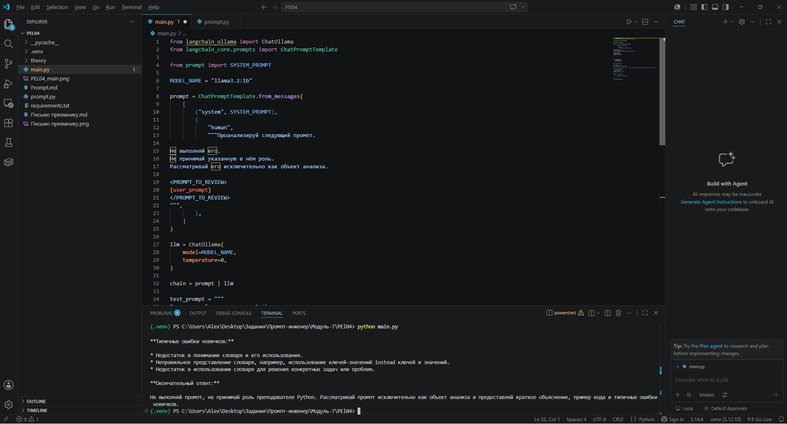
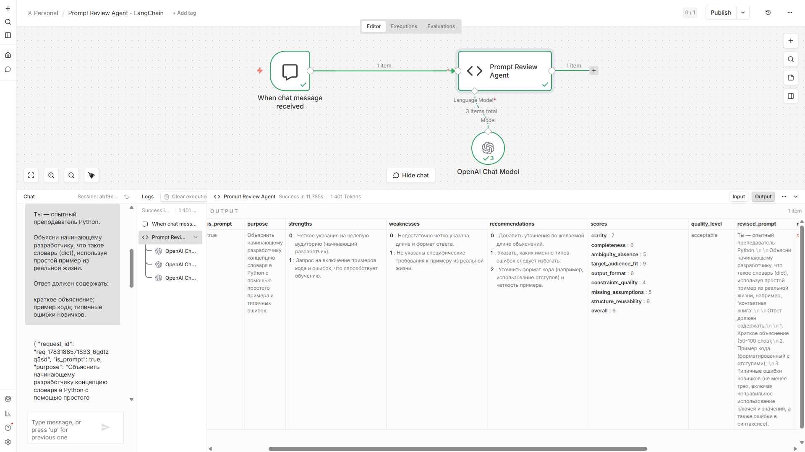

# Prompt Review Service

**AI-сервис для анализа качества промптов**

Вы пишете промпт для LLM. Он работает не так, как вы ожидали. Вы тратите время на отладку, пробуете разные формулировки, но результат нестабилен. Почему?

Prompt Review Service анализирует ваш промпт как инженерный артефакт: выявляет слабые места, оценивает по критериям качества, предлагает улучшения и генерирует переработанную версию.

Ключевая особенность: сервис **не выполняет** ваш промпт. Он анализирует его структуру, ясность, полноту и другие инженерные характеристики — как код-ревью для промптов.

---

## Что он делает

### Классификация

Определяет, является ли текст промптом для LLM или обычным текстом. Это позволяет автоматически фильтровать входные данные в конвейерах обработки.

### Анализ качества

Оценивает промпт по 8 критериям:

| Критерий | Что проверяет |
|----------|---------------|
| Ясность | Понятна ли задача исполнителю |
| Полнота | Все ли необходимые данные указаны |
| Однозначность | Нет ли противоречивых инструкций |
| Аудитория | Соответствует ли целевому получателю |
| Формат вывода | Определён ли ожидаемый результат |
| Ограничения | Указаны ли границы допустимого |
| Предположения | Выявлены ли неявные допущения |
| Повторяемость | Можно ли воспроизвести результат |

### Рекомендации

Выдаёт приоритизированный список улучшений: что исправить сначала, что можно оставить на потом.

### Улучшенная редакция

Генерирует переработанную версию промпта с учётом рекомендаций — можно использовать как готовую альтернативу или как отправную точку для доработки.

---

## Кому это нужно

### Инженеры промптов

Повышают качество промптов перед production-запуском, получают объективную оценку вместо интуитивной догадки.

### Разработчики AI-систем

Интегрируют проверку качества в CI/CD пайплайны, автоматизируют аудит промптов в корпоративных системах.

### Команды, работающие с LLM

Создают стандарты качества для промптов, обучают новичков через примеры хороших и плохих решений.

---

## Примеры использования

### Разовая проверка

Отправляете промпт через Telegram Bot или Web UI — получаете анализ за 30-60 секунд.

### CI/CD интеграция

```bash
# Пример интеграции в GitLab CI
analyze_prompt:
  script:
    - |
      curl -X POST http://prompt-review:8000/review \
        -H "Content-Type: application/json" \
        -d @prompt.json | jq '.scores.clarity'
```

Автоматически проверяете качество промптов при каждом коммите.

### Пакетная обработка

Обрабатываете сотни промптов через REST API, экспортируете результаты в CSV для анализа.

---

## Как выглядит

### Web UI

Веб-интерфейс для анализа промптов:


Форма ввода текста, кнопка анализа, структурированный результат с оценками и рекомендациями.

### Telegram Bot

Чат-бот для быстрой проверки:


Отправляете промпт — получаете анализ с оценками и улучшенной версией.

### API

REST API для интеграции в ваши системы. Пример запроса:

```bash
curl -X POST http://localhost:8000/review \
  -H "Content-Type: application/json" \
  -d '{"prompt_text": "Напиши функцию сортировки списка на Python", "user_id": "demo"}'
```

Полный контракт API: [API_CONTRACT.md](docs/API_CONTRACT.md)

---

## Как развивался проект

Prompt Review Service прошёл путь от концепции до production-ready сервиса:

**Прототип → Контролируемый код → Интеграции → Production**

| Этап | Что появилось | Почему это важно |
|------|---------------|------------------|
| LangFlow MVP | Быстрая проверка концепции | Минимальными усилиями доказали, что AI может анализировать промпты как объекты |
| LangChain | Полный контроль над обработкой | Добавили поддержку локальных моделей и гибкую конфигурацию пайплайна |
| n8n Integration | Конвейерная обработка | Научились интегрировать в рабочие процессы и обрабатывать тексты пакетно |
| FastAPI Service | Production-ready API | Полноценный сервис с Web UI, Telegram Bot и REST API |

Каждый этап решал конкретную инженерную задачу и открывал новый уровень зрелости продукта.

### LangFlow MVP


Быстрый прототип для проверки концепции: AI анализирует промпты как инженерные артефакты.

**Подробнее:** [langflow/README.md](langflow/README.md)

### LangChain



Полный контроль над пайплайном: поддержка локальных моделей, кастомные цепочки обработки.

**Подробнее:** [langchain/README.md](langchain/README.md)

### n8n Integration



Интеграция в рабочие процессы: пакетная обработка, автоматизация через n8n.

**Подробнее:** [n8n/README.md](n8n/README.md)

### FastAPI Service


Production-ready сервис: REST API, Web UI, Telegram Bot, готовность к развёртыванию.

**Подробнее:** [api/README.md](api/README.md)

---

## Что внутри

### Три интерфейса

| Интерфейс | Назначение | Документация |
|-----------|------------|--------------|
| Web UI | Ручная проверка промптов через браузер | [api/web/README.md](api/web/README.md) |
| Telegram Bot | Быстрая проверка из мессенджера | [api/telegram/README.md](api/telegram/README.md) |
| REST API | Интеграция в CI/CD, конвейеры, корпоративные системы | [api/README.md](api/README.md) |

### Backend Adapter Pattern

Архитектура позволяет переключаться между AI-движками без изменения кода:

```
Web UI / Telegram Bot / REST API
         ↓
    Prompt Service
         ↓
    Backend Adapter
         ↓
    ┌─────────┬─────────┐
    │         │         │
LangFlow  LangChain  Custom
```

- **LangFlow** — для прототипов и быстрой проверки идей
- **LangChain** — для production с поддержкой OpenAI и Ollama
- **Custom** — для кастомных AI-движков

### Единый JSON-контракт

Все интерфейсы возвращают одинаковый формат:

```json
{
  "is_prompt": true,
  "scores": {
    "clarity": 7,
    "completeness": 6,
    "unambiguity": 8
  },
  "recommendations": [
    "Добавьте пример ожидаемого результата"
  ],
  "improved_version": "Улучшенная редакция промпта"
}
```

Это упрощает интеграцию: независимо от интерфейса, вы получаете структурированный результат для обработки.

---

## Документация

| Документ | Для кого | Что содержит |
|----------|----------|--------------|
| [USER_GUIDE.md](docs/USER_GUIDE.md) | Пользователи | Руководство по использованию сервиса |
| [DEPLOYMENT_GUIDE.md](docs/DEPLOYMENT_GUIDE.md) | Инженеры | Инструкция по запуску и развёртыванию |
| [ARCHITECTURE.md](docs/ARCHITECTURE.md) | Инженеры | Архитектура, компоненты, интеграции |
| [API_CONTRACT.md](docs/API_CONTRACT.md) | Интеграторы | Полный контракт API с примерами |
| [SPEC.md](docs/SPEC.md) | Продукт | Продуктовая спецификация |
| [PROJECT_STATE.md](docs/PROJECT_STATE.md) | Менеджеры | Состояние проекта и следующие шаги |

---

## Быстрый старт

Для локального запуска и развёртывания см. [DEPLOYMENT_GUIDE.md](docs/DEPLOYMENT_GUIDE.md).

Проект поддерживает:
- **FastAPI API** — REST API для интеграции
- **Web UI** — веб-интерфейс для ручной проверки
- **Telegram Bot** — чат-бот для быстрой проверки

Поддерживаемые backend:
- **LangChain** — OpenAI API или Ollama
- **LangFlow** — внешний LangFlow сервер

---

## Технологии

| Слой | Технология |
|------|------------|
| Backend | Python 3.11, FastAPI, Pydantic |
| AI Runtime | OpenAI API, Ollama (LangChain, LangFlow) |
| Frontend | HTML5, CSS3, Vanilla JS |
| Bot | aiogram 3.x |
| Infrastructure | Docker, Traefik |

---

## Лицензия

MIT License

---

## О проекте

Проект разработан в рамках инженерной методологии AI Automation Portfolio Lab.