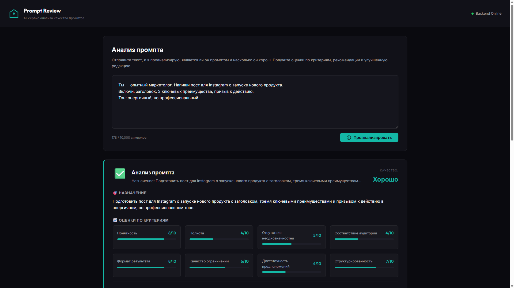
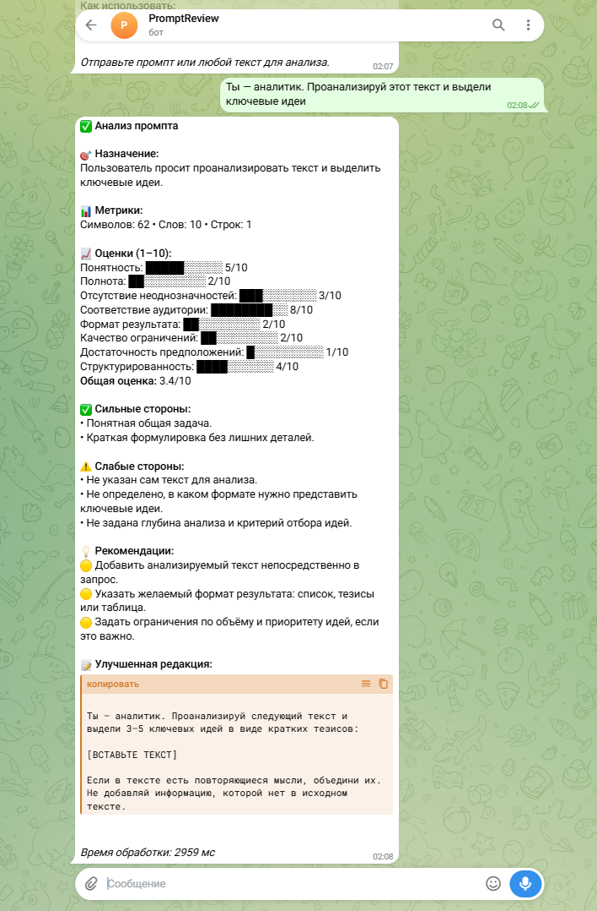

# Prompt Review Service

**AI-сервис для анализа качества промптов**

Prompt Review Service анализирует промпты, выявляет сильные и слабые стороны, оценивает качество по инженерным критериям, предлагает рекомендации по улучшению и генерирует улучшенную редакцию.

Ключевая особенность: агент рассматривает промпт как **объект инженерного анализа**, а не как задачу для выполнения. Он не выполняет промпт, не принимает указанную роль, сохраняет исходную цель и аудиторию.

---

## Возможности

### Анализ промптов

- **Классификация** — определяет, является ли текст промптом для LLM
- **Оценка качества** — анализирует по 8 критериям:
  - Ясность (clarity)
  - Полнота (completeness)
  - Отсутствие двусмысленности (ambiguity_absence)
  - Соответствие аудитории (target_audience_fit)
  - Формат вывода (output_format)
  - Качество ограничений (constraints_quality)
  - Учёт предположений (missing_assumptions)
  - Повторяемость структуры (structure_reusability)
- **Общая оценка** (overall) и уровень качества (quality_level)
- **Рекомендации** — приоритизированный список улучшений
- **Улучшенная редакция** — переработанная версия промпта

### Форматы взаимодействия

- **Web UI** — удобный веб-интерфейс с тёмной темой
- **Telegram Bot** — чат-бот для быстрой проверки
- **HTTP API** — REST API для интеграции

---

## Демонстрация

### Web UI



**Попробовать:** https://prompt-review-demo.alex-n8n.site

### Telegram Bot



**Попробовать:** @OptimusPromptReview_bot

### API

**Попробовать:** https://prompt-review-api.alex-n8n.site/docs

---

## Быстрый старт

### Онлайн

Просто откройте один из интерфейсов:

- **Web UI:** https://prompt-review-demo.alex-n8n.site
- **Telegram:** @OptimusPromptReview_bot
- **API:** https://prompt-review-api.alex-n8n.site/docs

### Локальный запуск

```bash
# Клонировать репозиторий
git clone https://github.com/username/prompt-review-service.git
cd prompt-review-service

# Установить зависимости
cd api
pip install -r requirements.txt

# Настроить переменные окружения
cp ../infra/.env.example ../infra/.env
# Отредактировать ../infra/.env с вашими ключами

# Запустить
uvicorn app.main:app --reload --port 8000
```

### Пример запроса

```bash
curl -X POST https://prompt-review-api.alex-n8n.site/review \
  -H "Content-Type: application/json" \
  -d '{
    "prompt_text": "Напиши функцию сортировки списка на Python",
    "user_id": "demo"
  }'
```

---

## Эволюция проекта

Prompt Review Service прошёл путь от прототипа до production-ready сервиса:

### Этап 1: LangFlow MVP (Прототип)

Визуальный конструктор для быстрой проверки концепции. Минимальные изменения — только системный промпт.

**Результат:** Подтверждение, что AI-агент может анализировать промпты как инженерный объект.

### Этап 2: LangChain (Контролируемый код)

Python-реализация с поддержкой локальных моделей. Два режима: линейный Chain и AgentExecutor с инструментами.

**Результат:** Полный контроль над обработкой, интеграция с Ollama.

### Этап 3: n8n (Интеграции)

Интеграция с оркестратором n8n. Два сценария: n8n+LangFlow и n8n+LangChain.

**Результат:** Единый JSON-контракт, модульный конвейер обработки, ветвление по типу текста.

### Этап 4: FastAPI (Production)

Production-ready API-сервис с публичным endpoint, двумя UI-сценариями и backend-вариантностью.

**Результат:** Публичный API, готовый к интеграции в production-системы.

---

## Архитектура

Prompt Review Service построен на паттерне Backend Adapter, что позволяет переключаться между LangFlow и LangChain без изменения кода.

**Подробнее:** [ARCHITECTURE.md](docs/ARCHITECTURE.md)

---

## API

### Endpoint

```
POST /review
```

### Запрос

```json
{
  "prompt_text": "Текст для анализа",
  "user_id": "user123",
  "review_mode": "standard"
}
```

### Ответ

```json
{
  "request_id": "req_...",
  "user_id": "user123",
  "is_prompt": true,
  "purpose": "Назначение промпта",
  "strengths": ["..."],
  "weaknesses": ["..."],
  "recommendations": [...],
  "scores": {
    "clarity": 8,
    "completeness": 7,
    "overall": 7.5
  },
  "quality_level": "good",
  "revised_prompt": "Улучшенная редакция..."
}
```

**Полный контракт:** [API_CONTRACT.md](docs/API_CONTRACT.md)

---

## Документация

| Документ | Назначение |
|----------|------------|
| [README.md](README.md) | Общее описание проекта (этот файл) |
| [PROJECT_STATE.md](docs/PROJECT_STATE.md) | Паспорт состояния проекта |
| [SPEC.md](docs/SPEC.md) | Продуктовая спецификация |
| [ARCHITECTURE.md](docs/ARCHITECTURE.md) | Архитектура и технические детали |
| [API_CONTRACT.md](docs/API_CONTRACT.md) | Логический контракт API |

---

## Технологии

- **Backend:** Python 3.11, FastAPI, Pydantic
- **AI Runtime:** OpenAI API / Ollama (LangFlow / LangChain)
- **Frontend:** HTML5, CSS3, Vanilla JS
- **Bot:** aiogram 3.x
- **Infrastructure:** Docker, PostgreSQL, Traefik

---

## Лицензия

MIT License

---

## Контакты

Проект развивается в рамках инженерной методологии AI Automation Portfolio Lab.