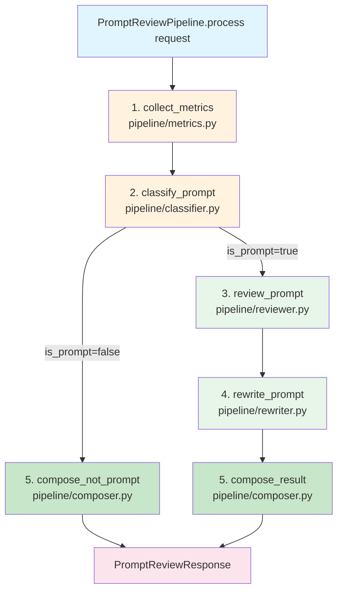

# ARCHITECTURE.md — Prompt Review Service

**Версия:** 1.0
**Дата:** 2026-07-07
**Статус:** Утверждено

---

## Обзор архитектуры

Prompt Review Service — AI-сервис для анализа качества пользовательских промптов. Проходит путь от учебного прототипа (PEl03) до production-ready API (PEl06).

### Эволюция проекта

| Этап | Технология | Ключевое достижение | Статус |
|------|------------|----------------------|--------|
| **PEl03** | LangFlow | MVP Prompt Review Agent | ✅ Учебный прототип |
| **PEl04** | LangChain | Chain + AgentExecutor + Tool | ✅ Учебный прототип |
| **PEl05** | n8n | Две интеграционные архитектуры | ✅ Учебный прототип |
| **PEl06** | FastAPI | Production-ready API-сервис | ✅ Каноническая реализация |

**Каноническая реализация:** PEl06 (FastAPI API-слой).

---

## Архитектура PEl06

### Общая схема

```mermaid
graph TD
    UI[User Interfaces<br/>Telegram / Web / n8n]
    
    UI -->|HTTP POST /review| API[FastAPI Layer]
    
    API -->|GET /| UP[{"status": "up"}]
    API -->|GET /health| OK[{"status": "ok"}]
    API -->|POST /review| REVIEW[PromptReviewResponse]
    
    API -->|BackendAdapter| ADAPTER{Backend Adapter Layer<br/>get_backend_adapter}
    
    ADAPTER -->|BACKEND_TYPE=langflow| LANGFLOW[LangFlowAdapter<br/>HTTP → LangFlow API]
    ADAPTER -->|BACKEND_TYPE=langchain| LANGCHAIN[LangChainAdapter<br/>PromptReviewPipeline]
    
    LANGCHAIN --> PIPELINE[PromptReviewPipeline<br/>Каноническая реализация<br/>LangChain backend]
    
    LANGFLOW -->|OpenAI API| LLM[LLM Runtime]
    PIPELINE -->|OpenAI API / Ollama| LLM
    
    style UI fill:#e1f5fe
    style API fill:#fff3e0
    style ADAPTER fill:#f3e5f5
    style LANGFLOW fill:#e8f5e9
    style LANGCHAIN fill:#e8f5e9
    style PIPELINE fill:#c8e6c9
    style LLM fill:#fce4ec
```

---

## Backend Adapter Pattern

### Назначение

Backend Adapter — абстрактный слой, отделяющий публичный API от конкретной реализации AI-движка.

### Реализация

**Source of Truth:** `api/app/adapters/base.py`, `api/app/adapters/__init__.py`.

```python
# base.py
class BackendAdapter(ABC):
    """Абстрактный базовый класс для backend-адаптеров."""
    
    @abstractmethod
    async def review(self, request: PromptReviewRequest) -> PromptReviewResponse:
        """Выполнить анализ промпта."""
        pass
    
    @abstractmethod
    async def health_check(self) -> bool:
        """Проверить доступность backend."""
        pass
```

```python
# __init__.py
def get_backend_adapter() -> BackendAdapter:
    """Фабрика адаптеров."""
    if settings.BACKEND_TYPE == "langflow":
        return LangFlowAdapter(...)
    elif settings.BACKEND_TYPE == "langchain":
        return LangChainAdapter(...)
    else:
        raise ValueError(f"Unknown BACKEND_TYPE: {settings.BACKEND_TYPE}")
```

### Конфигурация

**Source of Truth:** `api/app/config.py`.

```python
class Settings(BaseSettings):
    # Backend configuration
    BACKEND_TYPE: str = "langflow"  # langflow или langchain
    
    # LangFlow configuration
    LANGFLOW_URL: str = "http://localhost:7860"
    LANGFLOW_FLOW_ID: str = ""
    LANGFLOW_API_KEY: str = ""
    
    # LangChain configuration
    LANGCHAIN_MODEL: str = "openai"  # openai или ollama
    OPENAI_API_KEY: str = ""
    OLLAMA_BASE_URL: str = "http://localhost:11434"
    OLLAMA_MODEL: str = "gemma2:9b"
```

**Важно:**
- ✅ **LangFlow — backend по умолчанию** (`BACKEND_TYPE = "langflow"`)
- LangChain — альтернативный backend
- Выбор через переменную окружения `BACKEND_TYPE`

---

## LangFlow Adapter

### Назначение

Вызывает внешний LangFlow сервис через HTTP API.

### Реализация

**Source of Truth:** `api/app/adapters/langflow.py`.

### Особенности

- Вызывает LangFlow через HTTP POST `/api/v1/run/{flow_id}`
- Ожидает Structured Output с JSON-контрактом
- Рассчитывает метрики локально (как в PEl05)
- Преобразует JSON-ответ LangFlow в `PromptReviewResponse`

### Когда использовать

- Когда LangFlow развёрнут как отдельный сервис
- Когда нужен визуальный редактор для изменения Flow
- Когда нужно переиспользовать Flow из PEl03

---

## LangChain Adapter

### Назначение

Выполняет LangChain pipeline напрямую через PromptReviewPipeline.

### Реализация

**Source of Truth:** `api/app/adapters/langchain.py`.

### PromptReviewPipeline

**Каноническая реализация LangChain backend.**

**Source of Truth:** `api/app/pipeline/pipeline.py`.

#### Архитектура конвейера



#### Модули

| Модуль | Файл | Назначение |
|--------|------|------------|
| `collect_metrics` | `pipeline/metrics.py` | Инструментальный расчёт метрик промпта |
| `classify_prompt` | `pipeline/classifier.py` | Классификация (промпт/не промпт) через LLM |
| `review_prompt` | `pipeline/reviewer.py` | Анализ качества промпта через LLM |
| `rewrite_prompt` | `pipeline/rewriter.py` | Улучшение редакции промпта через LLM |
| `compose_result` | `pipeline/composer.py` | Формирование JSON-ответа |

#### Промпты

**Source of Truth:** `api/app/pipeline/prompts.py`.

| Промпт | Назначение |
|--------|------------|
| `CLASSIFIER_PROMPT` | Классификация текста (промпт/не промпт) |
| `REVIEW_PROMPT` | Анализ качества промпта |
| `REWRITER_PROMPT` | Улучшение редакции промпта |

**Важно:** Промпты перенесены из PEl05 без изменений.

### Когда использовать

- Когда нужен полный контроль над pipeline
- Когда нужно локальное выполнение без внешнего сервиса
- Когда нужно использовать локальные модели через Ollama

---

## Взаимодействие FastAPI и BackendAdapter

### Критически важная информация

⚠️ **FastAPI НЕ взаимодействует напрямую с PromptReviewPipeline.**

FastAPI взаимодействует **только** с `BackendAdapter` через фабрику `get_backend_adapter()`.

### Цепочка вызова

```mermaid
sequenceDiagram
    participant Client as HTTP Client
    participant API as FastAPI<br/>main.py
    participant Factory as get_backend_adapter
    participant LangFlow as LangFlowAdapter
    participant LangChain as LangChainAdapter
    participant Pipeline as PromptReviewPipeline
    participant LLM as LangFlow API / LLM

    Client->>API: POST /review
    API->>Factory: get_backend_adapter
    
    alt BACKEND_TYPE = langflow
        Factory->>LangFlow: return LangFlowAdapter
        LangFlow->>LLM: HTTP POST /api/v1/run/{flow_id}
        LLM-->>LangFlow: JSON response
        LangFlow->>LangFlow: Transform JSON<br/>→ PromptReviewResponse
        LangFlow-->>API: PromptReviewResponse
    else BACKEND_TYPE = langchain
        Factory->>LangChain: return LangChainAdapter
        LangChain->>Pipeline: PromptReviewPipeline.process
        Pipeline->>LLM: LLM calls (OpenAI / Ollama)
        LLM-->>Pipeline: LLM responses
        Pipeline->>Pipeline: Compose result
        Pipeline-->>LangChain: PromptReviewResponse
        LangChain-->>API: PromptReviewResponse
    end
    
    API-->>Client: PromptReviewResponse

    style Client fill:#e1f5fe
    style API fill:#fff3e0
    style Factory fill:#f3e5f5
    style LangFlow fill:#e8f5e9
    style LangChain fill:#e8f5e9
    style Pipeline fill:#c8e6c9
    style LLM fill:#fce4ec
```

### Почему так сделано

1. **Гибкость:** Можно переключаться между LangFlow и LangChain без изменения кода FastAPI.
2. **Тестируемость:** Можно мокать адаптеры для тестирования.
3. **Расширяемость:** Можно добавить новые backend без изменения FastAPI.
4. **Разделение ответственности:** FastAPI отвечает только за HTTP-слой, адаптеры — за AI-логику.

---

## Source of Truth

### Код

| Компонент | SOT | Назначение |
|-----------|-----|------------|
| JSON-контракт | `api/app/schemas.py` | Pydantic-модели запроса и ответа |
| Промпты | `api/app/pipeline/prompts.py` | Системные промпты для LLM |
| Бизнес-логика | `api/app/pipeline/pipeline.py` | PromptReviewPipeline |
| API спецификация | `api/app/main.py` | FastAPI endpoints |
| Конфигурация | `api/app/config.py` | Переменные окружения |
| Адаптеры | `api/app/adapters/` | LangFlowAdapter, LangChainAdapter |

### Документация

| Документ | Назначение |
|----------|------------|
| `README.md` | Публичное описание проекта |
| `docs/PROJECT_STATE.md` | Паспорт состояния проекта |
| `docs/SPEC.md` | Продуктовая спецификация |
| `docs/ARCHITECTURE.md` | Архитектура системы (этот документ) |
| `docs/API_CONTRACT.md` | Логический контракт API |

---

## Соответствие overall и quality_level

### Назначение

Правило соответствия между числовой оценкой `overall` и текстовым значением `quality_level` — критически важное архитектурное решение, обеспечивающее консистентность ответов API.

### Правило соответствия

| overall | quality_level | Семантика |
|---------|---------------|-----------|
| ≥ 9.0 | `excellent` | Отличный промпт |
| 7.0 - 8.9 | `good` | Хороший промпт |
| 5.0 - 6.9 | `fair` | Рабочий промпт |
| 3.0 - 4.9 | `poor` | Слабый промпт |
| < 3.0 | `not_applicable` | Текст не является промптом |

### Где реализовано

| Компонент | Реализация | Статус |
|-----------|-------------|--------|
| LangChain промпт | `api/app/pipeline/prompts.py` | ✅ Добавлено правило в формат-инструкции |
| LangFlow промпт | LangFlow Flow JSON | ✅ Добавлено правило в системный промпт |
| Валидация | `api/app/pipeline/reviewer.py` | ✅ Добавлена валидация и маппинг |
| Документация | `docs/API_CONTRACT.md` | ✅ Задокументировано как правило |
| Telegram Bot | `api/telegram/formatter.py` | ✅ Добавлен маппинг для отображения |

### Критически важная информация

**Проблема:** LLM может возвращать некорректное значение `quality_level`, не соответствующее `overall`.

**Решение:** Валидация в `reviewer.py` проверяет соответствие и исправляет некорректные значения:

```python
# Маппинг quality_level на основе overall
if scores.overall >= 9:
    quality_level_expected = "excellent"
elif scores.overall >= 7:
    quality_level_expected = "good"
elif scores.overall >= 5:
    quality_level_expected = "fair"
elif scores.overall >= 3:
    quality_level_expected = "poor"
else:
    quality_level_expected = "not_applicable"

# Проверка соответствия
if quality_level_raw != quality_level_expected:
    logger.warning(f"quality_level '{quality_level_raw}' doesn't match overall {scores.overall}")
    quality_level = quality_level_expected
```

**Результат:** API всегда возвращает корректное соответствие `overall` ↔ `quality_level`, даже если LLM ошибся.

### Маппинг для отображения

**Telegram Bot и Web UI** используют маппинг для перевода `quality_level` на русский язык:

| quality_level | Telegram Bot | Web UI |
|---------------|--------------|--------|
| `excellent` | "Отлично" ✅ | "Отлично" ✅ |
| `good` | "Хорошо" ✓ | "Хорошо" ✓ |
| `fair` | "Удовлетворительно" ⚠️ | "Удовлетворительно" ⚠️ |
| `poor` | "Плохо" ❌ | "Плохо" ❌ |
| `not_applicable` | "Не применимо" ∅ | "Не применимо" ∅ |

---

## Конфигурация backend

### LangFlow (по умолчанию)

```bash
# .env
BACKEND_TYPE=langflow
LANGFLOW_URL=https://langflow.example.com
LANGFLOW_FLOW_ID=your-flow-id
LANGFLOW_API_KEY=your-api-key
```

### LangChain

```bash
# .env
BACKEND_TYPE=langchain
LANGCHAIN_MODEL=openai
OPENAI_API_KEY=sk-...
```

или

```bash
# .env
BACKEND_TYPE=langchain
LANGCHAIN_MODEL=ollama
OLLAMA_BASE_URL=http://localhost:11434
OLLAMA_MODEL=gemma2:9b
```

---

## История архитектуры

### PEl03: LangFlow MVP

- Визуальный конструктор LangFlow
- Единый промпт
- Нет JSON-контракта
- Нет API

### PEl04: LangChain

- Python-код: Chain и AgentExecutor
- Инструмент `prompt_metrics`
- Нет JSON-контракта
- Нет API

### PEl05: n8n интеграции

- Модульный конвейер (впервые)
- JSON-контракт (впервые)
- Два сценария: n8n+LangFlow, n8n+LangChain
- Ветвление по `is_prompt`

### PEl06: FastAPI API-слой

- **PromptReviewPipeline** — каноническая реализация LangChain backend
- **BackendAdapter** — паттерн для переключения между backend
- **Pydantic-модели** — формализация JSON-контракта
- **FastAPI endpoints** — публичный API

---

## Архитектурные решения

### 1. Backend Adapter Pattern

**Решение:** Использовать паттерн Adapter для отделения API от AI-движка.

**Обоснование:**
- Гибкость в выборе backend
- Возможность тестирования с mock-адаптерами
- Расширяемость без изменения FastAPI

**Альтернатива:** Прямой вызов PromptReviewPipeline из FastAPI.

**Почему отклонена:** Жёсткая связка FastAPI и LangChain, невозможно переключиться на LangFlow.

---

### 2. LangFlow как backend по умолчанию

**Решение:** Установить `BACKEND_TYPE = "langflow"` по умолчанию.

**Обоснование:**
- LangFlow — визуальный редактор, удобный для настройки
- PromptReviewPipeline требует LLM API ключ или Ollama
- LangFlow уже может быть развёрнут в инфраструктуре

**Альтернатива:** LangChain по умолчанию.

**Почему отклонена:** Требует дополнительных настроек (API ключ, Ollama).

---

### 3. PromptReviewPipeline как часть LangChainAdapter

**Решение:** PromptReviewPipeline используется только через LangChainAdapter.

**Обоснование:**
- Единая точка входа через BackendAdapter
- Возможность добавления других LangChain-реализаций
- Чистое разделение ответственности

**Альтернатива:** PromptReviewPipeline как standalone-класс.

**Почему отклонена:** Нарушает паттерн Adapter, создаёт вторую точку входа.

---

## Ограничения

### Текущие ограничения

1. **Нет аутентификации:** API открытый, требуется API_KEY для продакшена.
2. **Нет rate limiting:** Нет ограничений на количество запросов.
3. **Нет персистентности:** Нет сохранения истории запросов.
4. **Нет очереди:** Запросы обрабатываются синхронно.

### Будущие улучшения

1. Добавить аутентификацию через API_KEY.
2. Добавить rate limiting.
3. Добавить очередь запросов (Celery/RQ).
4. Добавить персистентность (PostgreSQL).

---

## Связанные документы

- [PROJECT_STATE.md](PROJECT_STATE.md) — паспорт состояния проекта
- [SPEC.md](SPEC.md) — продуктовая спецификация
- [API_CONTRACT.md](API_CONTRACT.md) — логический контракт API
- [README.md](../README.md) — публичное описание проекта