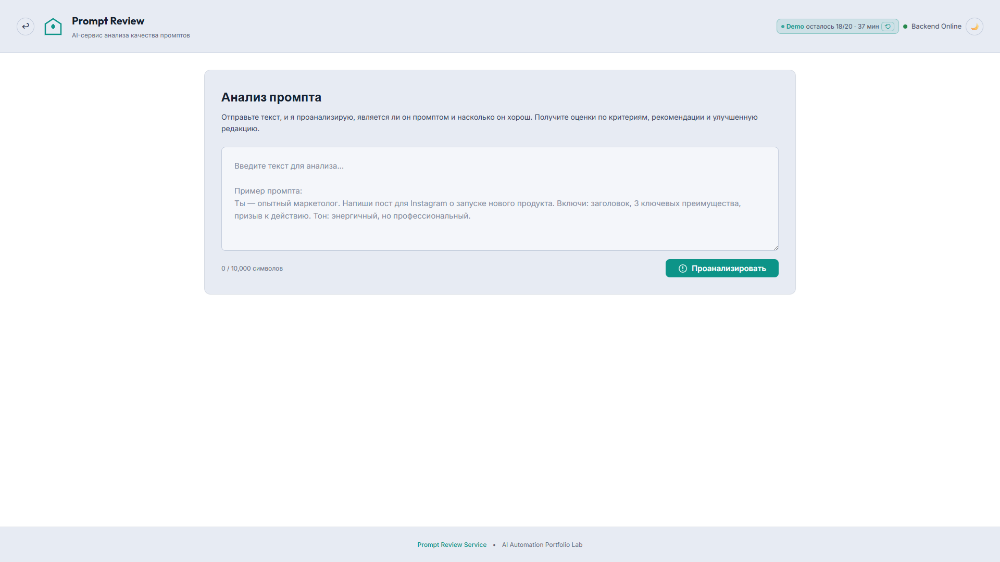
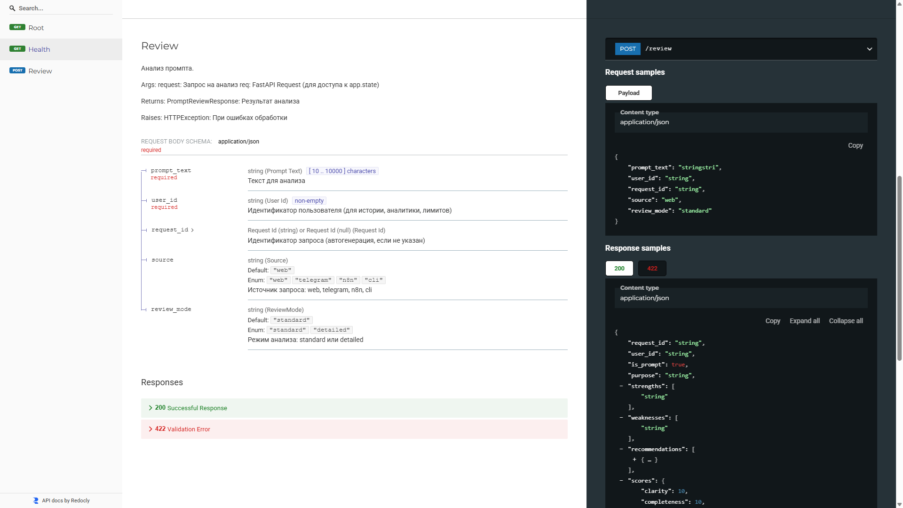
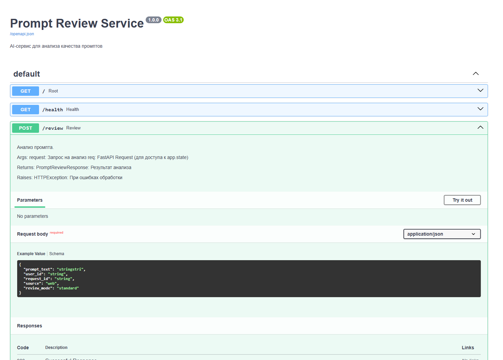
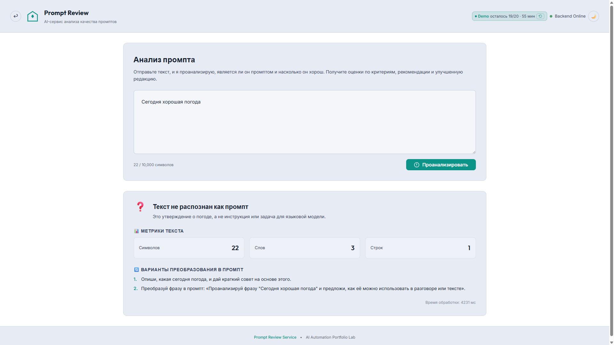
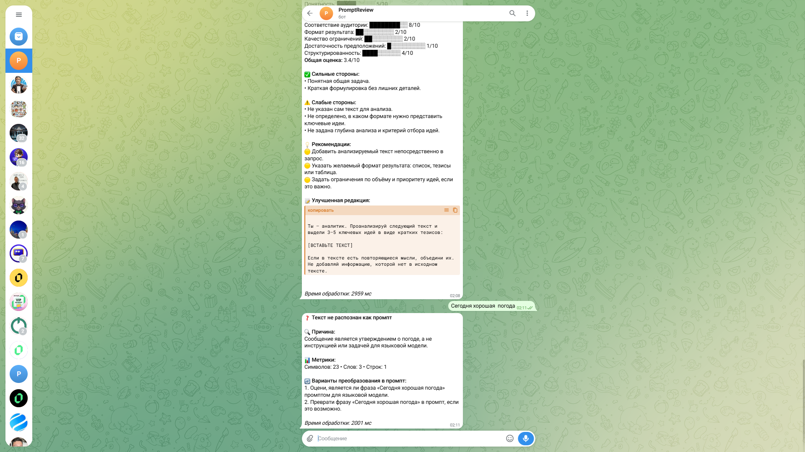

# 🎬 SYSTEM_DEMO.md — Prompt Review Service

**Last Updated:** 2026-08-30
**Основной читатель:** заказчик, инвестор, менеджер

Документ демонстрирует сервис как работающий продукт: что нужно сделать пользователю и что он получает. Технические детали — в [ARCHITECTURE.md](ARCHITECTURE.md), развёртывание — в [DEPLOYMENT_GUIDE.md](DEPLOYMENT_GUIDE.md).

---

## 🎯 1. Что демонстрируют сценарии

Сервис проверяет три тезиса:

1. **Понимает, что перед ним.** Отделяет промпт от обычного текста и корректно обрабатывает оба случая.
2. **Измеряет качество.** Оценивает промпт по 8 инженерным критериям, а не «гадает».
3. **Доводит до результата.** Выдаёт не список проблем, а приоритизированные рекомендации и готовую улучшенную редакцию.

---

## 🖥️ 2. Сценарий 1: Разовая проверка через Web UI

**Кто:** инженер, который перед запуском хочет проверить свой промпт.

**Шаг 1.** Пользователь открывает веб-форму и вставляет текст промпта:

**Шаг 2.** Через 30–60 секунд пользователь получает структурированный результат: общая оценка, разбивка по критериям, сильные и слабые стороны, рекомендации:

**Ключевое в результате:** сервис показывает не средний балл, а *конкретные слабые места* и приоритет исправлений.

На публичной демо-версии действует ограниченная демо-сессия: счётчик запросов и таймер видны в шапке, новую сессию можно начать в один клик. Локальная установка ограничений не имеет.

---

## 💬 3. Сценарий 2: Быстрая проверка через Telegram Bot

**Кто:** пользователь, работающий в мессенджере, без доступа к веб-интерфейсу.

**Шаг 1.** Пользователь отправляет промпт боту:

**Шаг 2.** Бот возвращает анализ с оценками и улучшенной версией промпта:

---

## 🔌 4. Сценарий 3: Интеграция через REST API

**Кто:** команда, встраивающая проверку промптов в свои системы: CI/CD-пайплайны, конвейеры обработки, CRM.

Сервис принимает промпт через `POST /review` и возвращает единый JSON-контракт:

Контракт одинаков для всех интерфейсов — Web UI, Telegram и API возвращают одинаковую структуру. Это позволяет построить на сервисе автоматический аудит: например, блокировать в CI коммит с промптом ниже порога качества.

Примеры запросов и ответов: [API_CONTRACT.md](API_CONTRACT.md) и [examples/README.md](examples/README.md).

---

## 🔀 5. Пограничный случай: текст не промпт

Если пользователь отправляет обычный текст (не инструкцию для LLM), сервис не «угадывает» задачу, а честно возвращает ветку «это не промпт»:

**Зачем это нужно:** в автоматизациях входные данные приходят без контроля — разделение «промпт / не промпт» позволяет строить конвейеры, которые не ломаются на произвольном тексте.

---

## 🏗️ 6. Как устроен выбор AI-движка

Сервис поддерживает два движка (выбор через переменную окружения `BACKEND_TYPE`, без изменения кода):

| Движок | Роль |
|--------|------|
| **LangChain** | Основной сценарий — полный контроль над пайплайном в коде, OpenAI и Ollama |
| **LangFlow** | Фоллбэк-сценарий — визуальный flow, логика анализа редактируется без изменения кода |

История эволюции движков: [README.md](../README.md) → раздел «Как развивался проект».

---

## 📑 7. Полный каталог скриншотов

Каталог всех изображений с матрицей использования: [screenshots/MEDIA_INDEX.md](screenshots/MEDIA_INDEX.md).

---

## 📜 История изменений

| Дата | Изменение |
|------|-----------|
| 2026-08-30 | Первая версия: три демонстрационных сценария + пограничный случай |