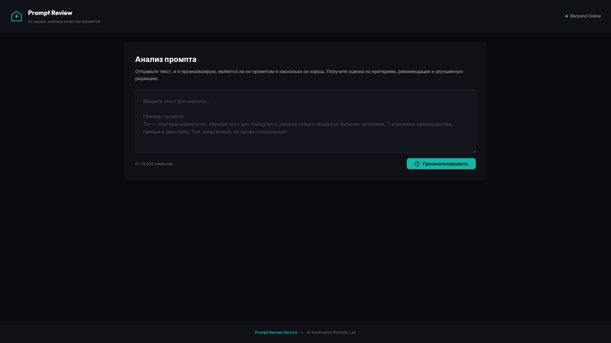
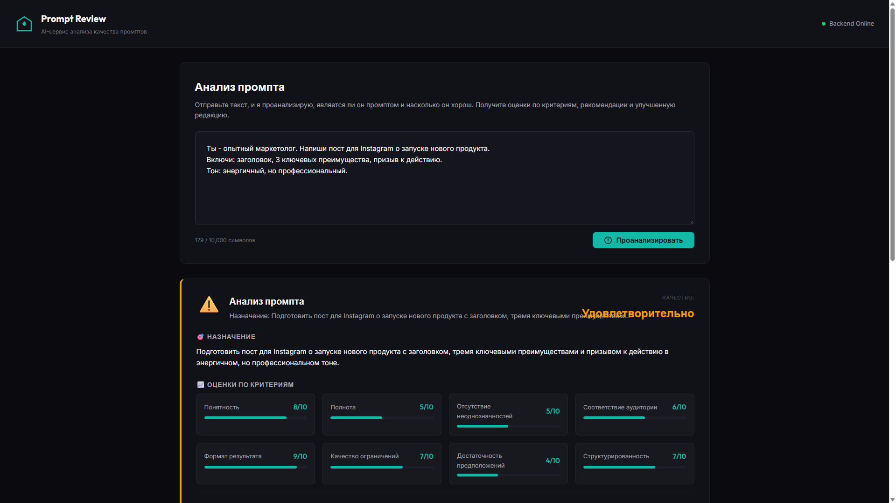
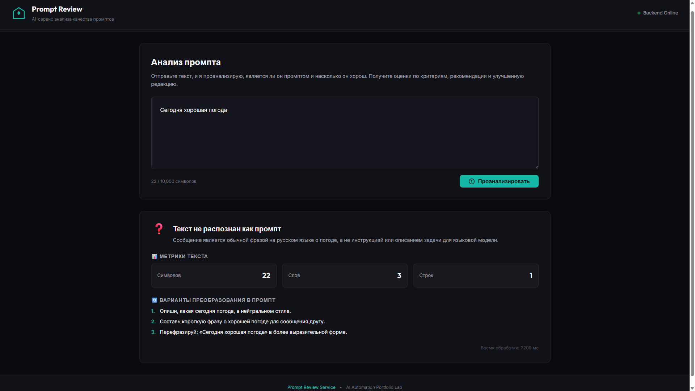
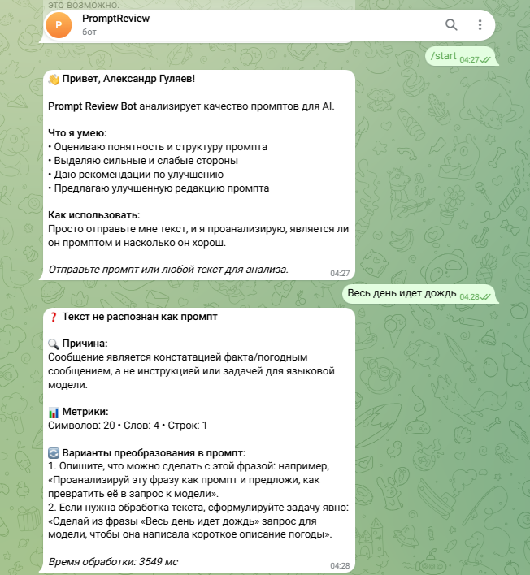
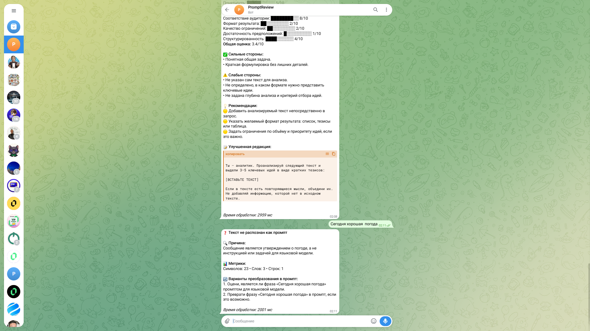

# Руководство пользователя Prompt Review Service

**Последнее обновление:** 2026-07-07
**Версия:** 1.0.0

---

## О руководстве

Это руководство для пользователей Prompt Review Service — AI-сервиса для анализа качества промптов.

**Для кого:**
- Инженеры промптов
- Разработчики AI-систем
- Команды, работающие с LLM

**Назначение:**
- Научить пользоваться всеми интерфейсами сервиса
- Объяснить критерии оценки качества промптов
- Показать практические сценарии использования

**Связанные документы:**
- [DEPLOYMENT_GUIDE.md](DEPLOYMENT_GUIDE.md) — для инженеров по развёртыванию
- [API_CONTRACT.md](API_CONTRACT.md) — для интеграторов
- [SPEC.md](SPEC.md) — продуктовая спецификация

---

## Что такое Prompt Review Service

Prompt Review Service анализирует промпты для LLM как инженерные артефакты.

**Ключевое отличие:** Сервис **не выполняет** ваш промпт. Он анализирует его структуру, ясность, полноту и другие характеристики — как код-ревью для промптов.

**Что вы получаете:**
- Классификацию: промпт или не промпт
- Оценку по 8 критериям качества
- Приоритизированные рекомендации
- Улучшенную редакцию промпта

**Время ответа:** 30–60 секунд в зависимости от backend.

---

## Способы использования

| Интерфейс | Назначение | Скорость | Удобство |
|-----------|------------|-----------|----------|
| **Web UI** | Ручная проверка через браузер | 30–60 сек | Интуитивный |
| **Telegram Bot** | Быстрая проверка из мессенджера | 30–60 сек | Мобильный |
| **REST API** | Интеграция в CI/CD, конвейеры | 30–60 сек | Программный |

---

## Web UI: Ручная проверка промптов

### Доступ к Web UI

1. Откройте браузер
2. Перейдите по адресу сервиса (например, `http://localhost:8000`)
3. Вы увидите форму для ввода текста



### Использование

**Шаг 1: Введите текст**

Вставьте текст, который хотите проверить, в поле ввода:

```
Напиши функцию сортировки списка на Python
```

**Шаг 2: Нажмите "Analyze"**

Нажмите кнопку "Analyze" для отправки запроса.

**Шаг 3: Получите результат**

Через 30–60 секунд вы получите структурированный ответ.

### Интерпретация результатов

#### Пример: Текст является промптом



**Результат содержит:**

| Поле | Описание |
|------|----------|
| `is_prompt` | `true` — текст распознан как промпт |
| `scores` | Оценки по 8 критериям (1–10) |
| `recommendations` | Список рекомендаций по улучшению |
| `improved_version` | Переработанная версия промпта |

#### Пример: Текст не является промптом



**Результат содержит:**

| Поле | Описание |
|------|----------|
| `is_prompt` | `false` — текст не является промптом |
| `scores` | Пустой объект `{}` |
| `recommendations` | Пустой массив `[]` |
| `improved_version` | `null` |

### Примеры анализа промпта

#### Пример 1: Слабый промпт

**Ввод:**
```
Напиши функцию сортировки
```

**Типичные проблемы:**
- Низкая оценка ясности: не указан язык программирования
- Низкая полнота: не указан тип данных
- Отсутствует формат вывода

#### Пример 2: Улучшенный промпт

**Ввод:**
```
Напиши функцию сортировки списка чисел на Python.
Функция должна принимать список целых чисел и возвращать
отсортированный список по возрастанию. Используй алгоритм
быстрой сортировки (quicksort).
```

**Типичный результат:**
- Высокая оценка ясности: задача понятна
- Высокая полнота: указаны все необходимые данные
- Определён формат вывода: функция на Python

---

## Telegram Bot: Быстрая проверка из мессенджера

### Начало работы с ботом

1. Найдите бота в Telegram (имя бота зависит от развёртывания)
2. Нажмите "Start" или отправьте команду `/start`



### Команды бота

| Команда | Описание |
|---------|----------|
| `/start` | Начать работу с ботом |
| `/help` | Показать справку |
| `/analyze <текст>` | Проанализировать текст |

### Отправка промпта на анализ

**Способ 1: Через команду**

```
/analyze Напиши функцию сортировки списка на Python
```

**Способ 2: Прямым сообщением**

Просто отправьте текст промпта без команды.

### Получение результатов

#### Пример: Анализ промпта


#### Пример: Текст не является промптом



---

## REST API: Интеграция в системы

### Когда использовать API

- CI/CD пайплайны для автоматической проверки промптов
- Пакетная обработка больших объёмов текстов
- Интеграция в корпоративные системы
- Автоматизированные рабочие процессы

### Базовый URL и endpoints

| Endpoint | Метод | Описание |
|----------|-------|----------|
| `/` | GET | Корневой endpoint (проверка доступности) |
| `/health` | GET | Health check для мониторинга |
| `/review` | POST | Анализ промпта |

### Примеры запросов

#### Проверка доступности

```bash
curl http://localhost:8000/
```

**Ответ:**
```json
{
  "service": "Prompt Review Service",
  "status": "running",
  "version": "1.0.0"
}
```

#### Health check

```bash
curl http://localhost:8000/health
```

**Ответ:**
```json
{
  "status": "healthy",
  "backend": "langflow"
}
```

#### Анализ промпта

```bash
curl -X POST http://localhost:8000/review \
  -H "Content-Type: application/json" \
  -d '{
    "prompt_text": "Напиши функцию сортировки списка на Python",
    "user_id": "demo"
  }'
```

**Ответ:**
```json
{
  "is_prompt": true,
  "scores": {
    "clarity": 7,
    "completeness": 6,
    "unambiguity": 8,
    "audience": 5,
    "format": 3,
    "constraints": 4,
    "assumptions": 6,
    "reproducibility": 5
  },
  "recommendations": [
    "Укажите тип данных для сортировки (числа, строки)",
    "Добавьте пример ожидаемого результата",
    "Укажите ограничения (максимальный размер списка)"
  ],
  "improved_version": "Напиши функцию сортировки списка чисел на Python..."
}
```

Полный контракт API: [API_CONTRACT.md](API_CONTRACT.md)

---

## Критерии качества промпта

Сервис оценивает промпты по 8 критериям (1–10 баллов):

### 1. Ясность (Clarity)

**Что проверяет:** Понятна ли задача исполнителю.

**Высокая оценка (8–10):**
- Задача сформулирована чётко
- Нет двусмысленностей
- Исполнитель понимает, что нужно сделать

**Низкая оценка (1–3):**
- Задача сформулирована размыто
- Требует додумывания
- Исполнитель не понимает ожидания

**Пример улучшения:**
```
❌ "Напиши что-нибудь про Python"
✅ "Напиши обзорную статью о применении Python в data science для начинающих"
```

### 2. Полнота (Completeness)

**Что проверяет:** Все ли необходимые данные указаны.

**Высокая оценка (8–10):**
- Указаны все входные данные
- Описаны требования
- Определены ограничения

**Низкая оценка (1–3):**
- Отсутствуют ключевые данные
- Требуется догадаться о контексте
- Неясны исходные условия

**Пример улучшения:**
```
❌ "Напиши функцию сортировки"
✅ "Напиши функцию сортировки списка целых чисел на Python. 
    Функция принимает список и возвращает отсортированный список."
```

### 3. Однозначность (Unambiguity)

**Что проверяет:** Нет ли противоречивых инструкций.

**Высокая оценка (8–10):**
- Инструкции не противоречат друг другу
- Понятен приоритет требований
- Нет конфликтующих указаний

**Низкая оценка (1–3):**
- Противоречивые требования
- Неясно, что важнее
- Несовместимые инструкции

**Пример улучшения:**
```
❌ "Напиши краткий, но подробный обзор"
✅ "Напиши обзор в 3–5 абзацев, включающий ключевые технические детали"
```

### 4. Аудитория (Audience)

**Что проверяет:** Соответствует ли целевому получателю.

**Высокая оценка (8–10):**
- Указан уровень аудитории
- Подобрана соответствующая терминология
- Учтён контекст использования

**Низкая оценка (1–3):**
- Неясно, для кого предназначен результат
- Терминология не соответствует уровню
- Отсутствует контекст

**Пример улучшения:**
```
❌ "Объясни машинное обучение"
✅ "Объясни концепцию машинного обучения для студентов первого курса IT-специальностей"
```

### 5. Формат вывода (Format)

**Что проверяет:** Определён ли ожидаемый результат.

**Высокая оценка (8–10):**
- Указан формат ответа
- Описана структура результата
- Есть пример вывода

**Низкая оценка (1–3):**
- Формат не указан
- Неясно, что считать ответом
- Нет представления о результате

**Пример улучшения:**
```
❌ "Напиши функцию"
✅ "Напиши функцию на Python. Результат должен быть в виде:
    def function_name(input: type) -> output_type:
        ..."
```

### 6. Ограничения (Constraints)

**Что проверяет:** Указаны ли границы допустимого.

**Высокая оценка (8–10):**
- Указаны ограничения (время, размер, ресурсы)
- Определены рамки задачи
- Учтены edge cases

**Низкая оценка (1–3):**
- Ограничения не указаны
- Неясны границы задачи
- Нет защиты от edge cases

**Пример улучшения:**
```
❌ "Обработай данные"
✅ "Обработай данные. Ограничения:
    - Максимальный размер файла: 100MB
    - Время выполнения: до 5 минут
    - Формат: JSON"
```

### 7. Предположения (Assumptions)

**Что проверяет:** Выявлены ли неявные допущения.

**Высокая оценка (8–10):**
- Явно указаны предположения
- Нет скрытых ожиданий
- Учтены альтернативы

**Низкая оценка (1–3):**
- Много неявных допущений
- Требуется догадаться о контексте
- Не учтены альтернативы

**Пример улучшения:**
```
❌ "Напиши код для обработки данных"
✅ "Напиши код для обработки данных. 
    Предполагается: данные в формате CSV, кодировка UTF-8, 
    разделитель — запятая."
```

### 8. Повторяемость (Reproducibility)

**Что проверяет:** Можно ли воспроизвести результат.

**Высокая оценка (8–10):**
- Результат детерминирован
- Указаны все параметры
- Воспроизводим при повторном выполнении

**Низкая оценка (1–3):**
- Результат зависит от случайных факторов
- Не указаны параметры
- Невоспроизводим

**Пример улучшения:**
```
❌ "Сгенерируй несколько примеров"
✅ "Сгенерируй 5 примеров использования данной функции с входными данными:
    [1, 2, 3], [5, 2, 8, 1], [10, -5, 0, 7]"
```

---

## Уровни качества

Каждый критерий оценивается от 1 до 10 баллов:

| Уровень | Баллы | Интерпретация |
|---------|-------|---------------|
| **Excellent** | 9–10 | Промпт безупречен по этому критерию |
| **Good** | 7–8 | Промпт хороший, но есть мелкие улучшения |
| **Fair** | 5–6 | Промпт приемлемый, требует доработки |
| **Poor** | 3–4 | Промпт имеет существенные проблемы |
| **Not Applicable** | 0 | Критерий не применим к этому промпту |

**Общая рекомендация:**
- Сосредоточьтесь на критериях с оценкой **Poor** (3–4)
- Затем улучшите критерии с оценкой **Fair** (5–6)
- **Good** (7–8) и **Excellent** (9–10) не требуют доработки

---

## Типичные сценарии использования

### Сценарий 1: Разовая проверка

**Задача:** Проверить промпт перед отправкой в LLM.

**Шаги:**
1. Откройте Web UI или Telegram Bot
2. Вставьте текст промпта
3. Нажмите "Analyze"
4. Ознакомьтесь с оценками и рекомендациями
5. При необходимости используйте улучшенную версию

**Результат:** Вы получаете объективную оценку качества промпта за 30–60 секунд.

---

### Сценарий 2: CI/CD интеграция

**Задача:** Автоматически проверять промпты при каждом коммите.

**Пример: GitLab CI**

```yaml
# .gitlab-ci.yml
analyze_prompt:
  stage: test
  script:
    - |
      curl -X POST http://prompt-review:8000/review \
        -H "Content-Type: application/json" \
        -d @prompt.json > result.json
    - |
      # Проверка минимального порога качества
      SCORE=$(jq '.scores.clarity' result.json)
      if [ "$SCORE" -lt 7 ]; then
        echo "Clarity score too low: $SCORE"
        exit 1
      fi
  rules:
    - changes:
      - prompt.json
      - prompts/**/*.json
```

**Результат:** Промпты автоматически проверяются на качество при каждом коммите.

---

### Сценарий 3: Пакетная обработка

**Задача:** Проанализировать сотни промптов и экспортировать результаты.

**Пример: Python скрипт**

```python
import requests
import csv
from pathlib import Path

# Параметры
API_URL = "http://localhost:8000/review"
PROMPTS_DIR = Path("./prompts")
OUTPUT_FILE = "analysis_results.csv"

# Сбор промптов
prompts = []
for file in PROMPTS_DIR.glob("*.txt"):
    prompts.append({
        "file": file.name,
        "text": file.read_text()
    })

# Анализ
results = []
for prompt in prompts:
    response = requests.post(API_URL, json={
        "prompt_text": prompt["text"],
        "user_id": "batch_processor"
    })
    result = response.json()
    results.append({
        "file": prompt["file"],
        "is_prompt": result["is_prompt"],
        "clarity": result["scores"].get("clarity", 0),
        "completeness": result["scores"].get("completeness", 0),
        "recommendations": len(result["recommendations"])
    })

# Экспорт в CSV
with open(OUTPUT_FILE, "w", newline="") as f:
    writer = csv.DictWriter(f, fieldnames=results[0].keys())
    writer.writeheader()
    writer.writerows(results)

print(f"Processed {len(results)} prompts. Results saved to {OUTPUT_FILE}")
```

**Результат:** Массовый анализ промптов с экспортом в CSV для дальнейшей обработки.

---

## Часто задаваемые вопросы

### Общие вопросы

**Q: Сервис выполняет мой промпт?**

A: Нет. Сервис анализирует структуру и качество промпта, но не выполняет его. Это позволяет проверять промпты без риска выполнения нежелательных инструкций.

**Q: Какой backend выбрать?**

A: 
- **LangFlow** — для прототипирования и быстрой проверки идей (по умолчанию)
- **LangChain** — для production с поддержкой OpenAI и Ollama

**Q: Как долго обрабатывается запрос?**

A: 30–60 секунд в зависимости от backend и загрузки AI-модели.

---

### Web UI

**Q: Как получить доступ к Web UI?**

A: Откройте браузер и перейдите по адресу сервиса (например, `http://localhost:8000`). Подробности в [DEPLOYMENT_GUIDE.md](DEPLOYMENT_GUIDE.md).

**Q: Можно ли сохранить историю запросов?**

A: Текущая версия не сохраняет историю. Используйте REST API для интеграции с системами хранения.

---

### Telegram Bot

**Q: Как найти бота?**

A: Имя бота зависит от конфигурации. Узнайте имя у администратора сервиса.

**Q: Есть ли ограничения на размер текста?**

A: Telegram ограничивает размер сообщения 4096 символами. Для длинных промптов используйте REST API.

---

### REST API

**Q: Какая аутентификация используется?**

A: Текущая версия не требует аутентификации. Для production рекомендуется добавить API key.

**Q: Как обработать ошибки?**

A: Сервис возвращает стандартные HTTP коды:
- `200` — успех
- `400` — ошибка валидации
- `422` — неверный формат запроса
- `500` — внутренняя ошибка
- `503` — сервис недоступен

**Q: Можно ли использовать batch-запросы?**

A: Нет, API обрабатывает один промпт за запрос. Для batch-обработки используйте скрипт из Сценария 3.

---

## Устранение неполадок

### Сервис не отвечает

**Симптом:** Web UI, Telegram Bot или API не отвечают.

**Диагностика:**
```bash
# Проверка статуса сервиса
curl http://localhost:8000/health

# Проверка логов
docker logs prompt-review-service
```

**Возможные причины:**
- Сервис не запущен
- Backend (LangFlow/LangChain) недоступен
- Проблема с сетью

**Решение:**
1. Проверьте статус Docker: `docker ps`
2. Проверьте логи: `docker logs prompt-review-service`
3. Перезапустите сервис: `docker restart prompt-review-service`

---

### Долгое время ответа

**Симптом:** Ответ приходит дольше 60 секунд.

**Диагностика:**
```bash
# Проверка времени ответа
time curl http://localhost:8000/review -X POST \
  -H "Content-Type: application/json" \
  -d '{"prompt_text": "test", "user_id": "test"}'
```

**Возможные причины:**
- Высокая нагрузка на AI-модель
- Медленный backend
- Сетевые проблемы

**Решение:**
1. Проверьте нагрузку: `docker stats`
2. Рассмотрите альтернативный backend
3. Оптимизируйте конфигурацию

---

### Некорректные оценки

**Симптом:** Оценки не соответствуют ожиданиям.

**Возможные причины:**
- AI-модель интерпретирует промпт иначе
- Промпт содержит специфический контекст
- Язык промпта отличается от ожидаемого

**Решение:**
1. Уточните промпт по критериям качества
2. Добавьте явные инструкции
3. Укажите контекст и ограничения

---

### Telegram Bot не работает

**Симптом:** Бот не отвечает на сообщения.

**Диагностика:**
```bash
# Проверка логов бота
docker logs prompt-review-bot
```

**Возможные причины:**
- Неверный токен бота
- Telegram API недоступен
- Проблема с webhook

**Решение:**
1. Проверьте токен: `echo $TELEGRAM_BOT_TOKEN`
2. Перезапустите бота: `docker restart prompt-review-bot`
3. Проверьте webhook: `curl https://api.telegram.org/bot<token>/getWebhookInfo`

---

## Связанные документы

| Документ | Назначение |
|----------|------------|
| [DEPLOYMENT_GUIDE.md](DEPLOYMENT_GUIDE.md) | Развёртывание и эксплуатация |
| [API_CONTRACT.md](API_CONTRACT.md) | Полный контракт API |
| [ARCHITECTURE.md](ARCHITECTURE.md) | Архитектура и компоненты |
| [SPEC.md](SPEC.md) | Продуктовая спецификация |
| [PROJECT_STATE.md](PROJECT_STATE.md) | Состояние проекта |

---

## Поддержка

При возникновении проблем:

1. Проверьте раздел "Устранение неполадок"
2. Обратитесь к [DEPLOYMENT_GUIDE.md](DEPLOYMENT_GUIDE.md)
3. Проверьте логи сервиса

---

**Последнее обновление:** 2026-07-07