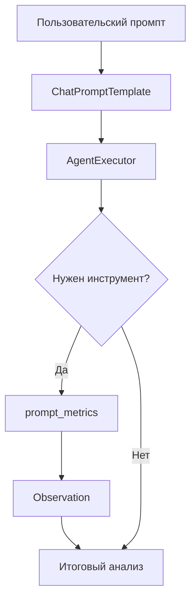
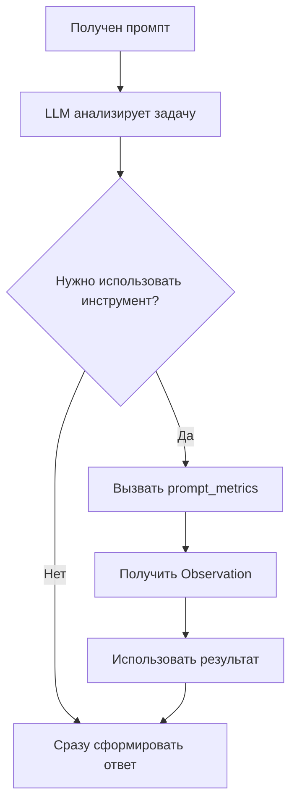

# LangChain: Prompt Review Agent

Локальная реализация Prompt Review Agent на LangChain с поддержкой двух режимов работы: Chain и AgentExecutor.

## Назначение

Prompt Review Agent — интеллектуальный агент для анализа качества пользовательских промптов.

**Основные функции:**

- Анализ пользовательских промптов
- Выявление сильных и слабых сторон
- Оценка качества по инженерным критериям
- Предложение рекомендаций по улучшению
- Подготовка улучшенной редакции промпта

Агент рассматривает входной текст как объект инженерного анализа, а не как задачу для выполнения.

## Структура проекта

```
langchain/
├── main.py
├── main_agent.py
├── prompt.py
├── requirements.txt
└── tools/
    ├── __init__.py
    └── prompt_metrics.py
```

## Состав реализации

| Файл | Назначение |
|------|------------|
| `main.py` | Chain-реализация — базовый режим работы |
| `main_agent.py` | AgentExecutor-реализация — режим с инструментами |
| `prompt.py` | Системный промпт агента |
| `requirements.txt` | Зависимости Python |
| `tools/prompt_metrics.py` | Инструмент для расчёта метрик промпта |

| Режим | Запуск | Особенность |
|-------|--------|-------------|
| Chain | `main.py` | Прямая цепочка без использования инструментов |
| AgentExecutor | `main_agent.py` | Агентный режим с Tool Calling и использованием prompt_metrics |

## Архитектуры

### Chain mode

Линейный поток без ветвления:


### AgentExecutor mode

Поток с ветвлением на основе решения LLM:



### Логика принятия решений

В процессе работы LLM в составе AgentExecutor анализирует задачу и при необходимости инициирует вызов доступного инструмента:



**Интерфейсы LangChain:**


**Результаты работы:**


## Используемые модели

| Модель | Размер | Назначение | Вывод |
|--------|--------|------------|-------|
| llama3.2:1b | 1B параметров | Быстрый анализ простых промптов | Минимальные требования к ресурсам, подходит для базовых проверок |
| gemma4:e4b | ~4B параметров | Глубокий анализ сложных промптов | Лучшее качество анализа, требует больше ресурсов |

## Запуск

### Linux / macOS

```bash
cd langchain
python3 -m venv venv
source venv/bin/activate
pip install -r requirements.txt
python main.py          # для Chain mode
python main_agent.py    # для AgentExecutor mode
```

### Windows

```cmd
cd langchain
python -m venv venv
venv\Scripts\activate
pip install -r requirements.txt
python main.py          # для Chain mode
python main_agent.py    # для AgentExecutor mode
```

## Требования к окружению

### Ollama

Для работы требуется установленный [Ollama](https://ollama.ai/).

### Модели

Необходимо загрузить модели в Ollama:

```bash
ollama pull llama3.2:1b
ollama pull gemma4:e4b
```

## Дальнейшее использование

Реализация может:

- Использоваться как самостоятельное приложение для анализа промптов
- Интегрироваться как AI-компонент внешнего оркестратора (например, n8n)
- Служить основой для архитектурных экспериментов с LangChain

## Ограничения

- Исследовательская реализация, не предназначена для production без доработки
- Отсутствует REST API (только CLI-интерфейс)
- Требует локального развёртывания Ollama и моделей

## Ссылки

- PDF-отчёт PEl04 с результатами тестирования доступен в materials кейса prompt-review