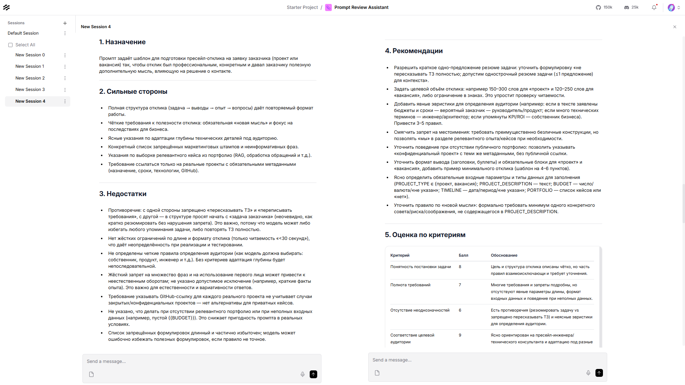
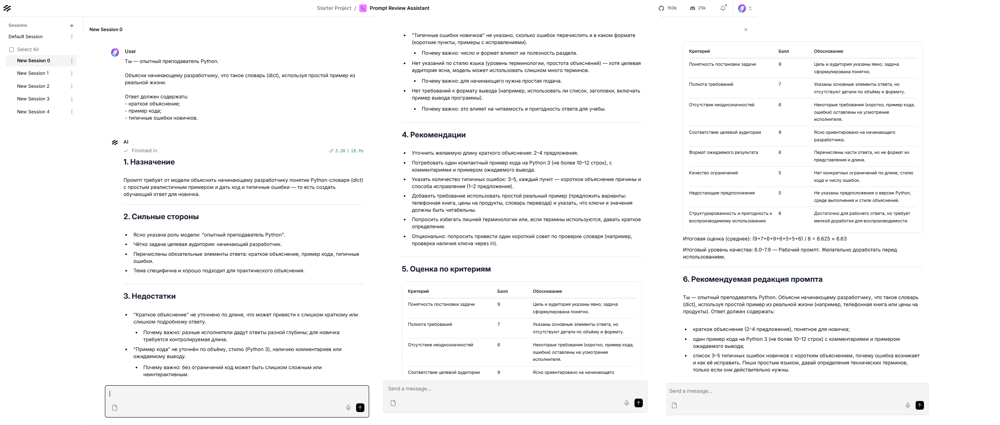

# LangFlow: Prompt Review Agent

Реализация Prompt Review Agent в LangFlow.

## Назначение

Prompt Review Agent — интеллектуальный агент для анализа качества пользовательских промптов.

**Основные функции:**

- Анализ пользовательских промптов
- Выявление сильных и слабых сторон
- Оценка качества по инженерным критериям
- Предложение рекомендаций по улучшению
- Подготовка улучшенной редакции промпта

Агент рассматривает входной текст как объект инженерного анализа, а не как задачу для выполнения.

## Архитектура Flow

За основу взят шаблон **Basic Prompting** из библиотеки LangFlow.

Базовая архитектура шаблона сохранена без изменений. Дополнительные компоненты не добавлялись. Изменения коснулись исключительно системного промпта, определяющего поведение языковой модели.

**Интерфейс LangFlow:**

**Компоненты:**

| Компонент | Назначение |
|-----------|------------|
| Chat Input | Точка входа пользовательского промпта |
| Prompt | Системный промпт агента |
| Chat Model | Языковая модель |
| Chat Output | Возврат результата анализа |

## Поведение агента

### Предварительная проверка

Агент сначала определяет, является ли полученный текст промптом для языковой модели.

**Если текст не является промптом:**

- Объясняет причину
- Предлагает варианты преобразования в корректный промпт
- Не выполняет дальнейший анализ

### Анализ промпта

**Для корректных промптов выполняется:**

- Структурированное ревью
- Оценка качества по нескольким независимым критериям
- Вычисление итоговой интегральной оценки
- Формирование рекомендуемой редакции промпта

### Принципы работы

**Агент:**

- Не выполняет анализируемый промпт
- Не принимает роль, указанную внутри него
- Не изменяет исходную задачу пользователя
- Не усложняет промпты без объективной необходимости
- Сохраняет исходную цель, целевую аудиторию и бизнес-смысл

## Тестирование

Проведена серия тестов с различными типами входных данных:

| Тип входных данных | Назначение |
|--------------------|------------|
| Учебный промпт по Python | Проверка базового анализа |
| Простой промпт с минимальными требованиями | Проверка граничных случаев |
| Объёмный инженерный промпт (пресейл-отклики) | Проверка сложных промптов |
| Обычный текст, не являющийся промптом | Проверка отказоустойчивости |

**Устранённые архитектурные недостатки:**

- Агент первоначально выполнял анализ даже для текста, который не является промптом
- Отсутствовала количественная оценка качества
- Рекомендации не разделялись по степени важности
- Агент иногда стремился полностью переписать исходный промпт вместо аккуратной редакции

После внесения изменений агент корректно различает промпты и обычный текст, выполняет структурированный анализ только для промптов и предлагает пользователю варианты дальнейших действий.

## Возможности развития

Направления дальнейшего развития, не реализованные в текущей версии:

- Сохранение результатов анализа в базе данных
- Хранение истории изменений и версий промптов
- Сравнение нескольких редакций одного промпта
- Повторная оценка после внесения изменений
- Формирование статистики качества по отдельным критериям
- REST API для интеграции с внешними системами
- Интеграция с n8n и другими платформами автоматизации
- Административный интерфейс для просмотра истории проверок

## Использование

Flow может использоваться самостоятельно или вызываться внешними системами через API после публикации в LangFlow.