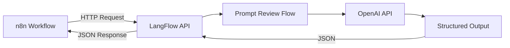
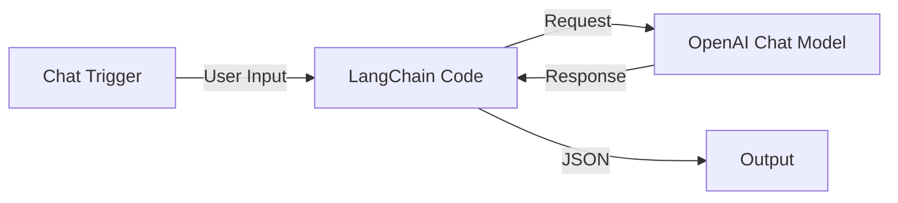
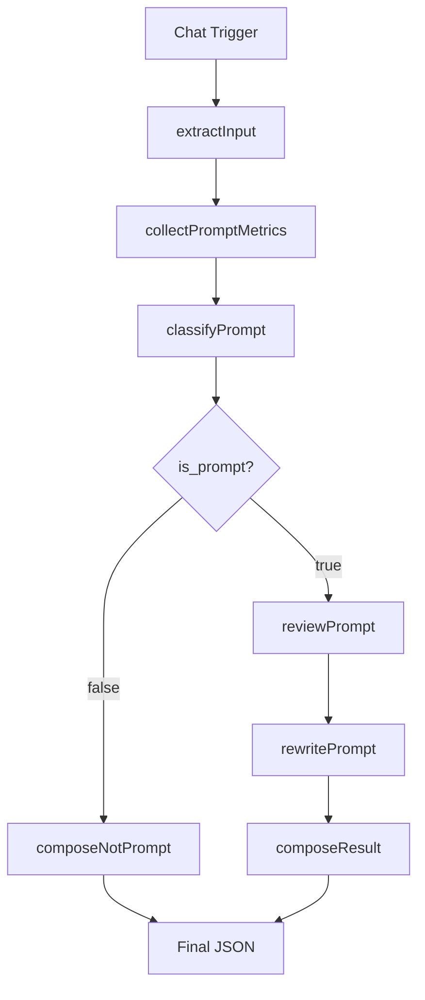

# n8n: Prompt Review Agent

Реализация сценариев PEl05 — интеграция n8n с AI-компонентами для анализа качества промптов.

## Назначение

Prompt Review Agent как AI-компонент в архитектуре n8n + LangFlow / LangChain.

**Основные функции:**

- Анализ пользовательских промптов
- Выявление сильных и слабых сторон
- Оценка качества по инженерным критериям
- Предложение рекомендаций по улучшению
- Подготовка улучшенной редакции промпта
- Возврат структурированного JSON-ответа

## Статус

### Сценарий 1: n8n + LangFlow ✅

- ✅ Инфраструктура LangFlow развёрнута
- ✅ Prompt Review Flow создан
- ✅ Workflow n8n создан
- ✅ Интеграция протестирована

### Сценарий 2: n8n + LangChain ✅

- ✅ LangChain Code node реализован
- ✅ Workflow n8n создан
- ✅ Конвейер обработки протестирован
- ✅ Документация подготовлена

## Архитектура сценариев

### Сценарий 1: n8n + LangFlow

**Компоненты:**



| Компонент | Технология | Назначение |
|-----------|------------|------------|
| **n8n** | Workflow automation | Оркестрация бизнес-логики |
| **LangFlow** | Flow builder | AI-компонент для анализа промптов |
| **OpenAI API** | LLM API | Выполнение инференса моделей |
| **PostgreSQL** | Database | Хранение данных LangFlow |

**Поток данных:**

1. **n8n** получает пользовательский промпт
2. **n8n** отправляет HTTP-запрос в LangFlow API
3. **LangFlow** выполняет Prompt Review Flow
4. **OpenAI API** выполняет анализ
5. **Structured Output** формирует JSON-ответ
6. **LangFlow** возвращает JSON в n8n
7. **n8n** обрабатывает результат

### Сценарий 2: n8n + LangChain

**Компоненты:**



| Компонент | Технология | Назначение |
|-----------|------------|------------|
| **Chat Trigger** | n8n node | Приём пользовательского ввода |
| **LangChain Code** | n8n node | Интеллектуальный анализ промптов |
| **OpenAI Chat Model** | LangChain connector | Выполнение LLM-запросов |

**Почему n8n остаётся оркестратором:**

- ✅ Принимает сообщение из Chat Trigger
- ✅ Передаёт его в LangChain Code
- ✅ Получает JSON-результат
- ✅ Возвращает результат пользователю

**Вся интеллектуальная логика — внутри LangChain Code:**

- Последовательная обработка с ветвлением после классификатора
- Каждый этап выполняет одну задачу
- Чёткое разделение ответственности

**Workflow диаграммы:**


## Конвейер обработки (Сценарий 2)

LangChain Code реализует обработку с ветвлением после классификатора:



**Этапы обработки:**

**1. extractInput** — извлечение текста из Chat Trigger
   - Поддержка полей: chatInput, message, text, prompt_text
   - Формирование request: {request_id, source, review_mode, prompt_text}

**2. collectPromptMetrics** — расчёт объективных метрик
   - characters, words, lines, non_empty_lines
   - markdown_headings, bullet_items, numbered_items
   - markdown_table_lines, xml_tags, code_blocks
   - max_line_length, avg_line_length

**3. classifyPrompt** — определение типа текста
   - Определяет, является ли текст промптом для LLM
   - Возвращает: {is_prompt, reason, confidence}
   - Точка ветвления: два пути выполнения

**Если is_prompt = false:**

**composeNotPrompt** — формирование JSON для обычного текста
   - Возвращает: reason, conversion_options, metrics
   - scores = 0, quality_level = "not_applicable"

**Результаты работы:**


**Если is_prompt = true:**

**4. reviewPrompt** — анализ качества
   - purpose — назначение промпта
   - strengths — сильные стороны
   - weaknesses — недостатки
   - recommendations — рекомендации
   - scores — оценки по критериям
   - quality_level — итоговый уровень

**5. rewritePrompt** — улучшенная редакция
   - Сохраняет исходные формулировки
   - Исправляет только выявленные недостатки
   - Не меняет цель и аудиторию

**6. composeResult** — формирование JSON для промпта
   - Полный анализ с оценками
   - Улучшенная редакция

**Ветвление после классификатора:**

После classifyPrompt существует два различных пути выполнения:
- Путь 1: is_prompt = false → composeNotPrompt → Final JSON
- Путь 2: is_prompt = true → reviewPrompt → rewritePrompt → composeResult → Final JSON

Оба пути завершаются формированием структурированного JSON-ответа.

## Состав артефактов

### Сценарий 1: n8n + LangFlow

**Workflow n8n:**
- Файл: `workflow/Prompt Review Agent - LangFlow.json`
- Реализует: приём промпта → HTTP-запрос в LangFlow → обработка JSON → возврат результата

**Flow LangFlow:**
- Файл: `langflow/Prompt Review Agent - API JSON.json`
- Реализует: Chat Input → Prompt → Chat Model → Structured Output → Chat Output

### Сценарий 2: n8n + LangChain

**Workflow n8n:**
- Файл: `workflow/Prompt Review Agent - LangChain.json`
- Реализует: Chat Trigger → LangChain Code → OpenAI Chat Model → JSON Output

**LangChain Code:**
- Файл: `langchain/prompt-review-langchain-code.js`
- Реализует: обработку с ветвлением после классификатора
- Функции: extractInput, collectPromptMetrics, classifyPrompt, reviewPrompt, rewritePrompt, composeResult, composeNotPrompt

**Тесты:**
- Файл: `langchain/tests.md`
- Содержит позитивные и негативные тестовые примеры

## Реализованный функционал

### Сценарий 1: n8n + LangFlow ✅

**Что реализовано:**

- ✅ Развёртывание LangFlow на VPS (Docker + PostgreSQL)
- ✅ Создание Prompt Review Flow в LangFlow
- ✅ Настройка Structured Output для JSON-ответов
- ✅ Создание workflow n8n для интеграции
- ✅ End-to-end тестирование с OpenAI API

**Runtime:** OpenAI API

**Формат ответа:** JSON со структурой:
- `purpose` — назначение промпта
- `strengths` — сильные стороны
- `weaknesses` — недостатки
- `recommendations` — рекомендации
- `scores` — оценки по критериям
- `overall_score` — итоговая оценка
- `improved_prompt` — рекомендованная редакция

### Сценарий 2: n8n + LangChain ✅

**Что реализовано:**

- ✅ LangChain Code node с последовательным конвейером
- ✅ Workflow n8n для интеграции
- ✅ Классификатор текста (промпт или не промпт)
- ✅ Анализ качества по критериям
- ✅ Генерация улучшенной редакции промпта
- ✅ Тестовые примеры (позитивный и негативный)

**Runtime:** OpenAI API (через ai_languageModel)

**Формат ответа:** JSON, аналогичный сценарию 1.

## Инфраструктура

### Развёрнутые компоненты

| Компонент | Статус | Адрес |
|-----------|--------|-------|
| **LangFlow** | ✅ Running | Доступен после локального развёртывания |
| **PostgreSQL** | ✅ Running | Внутренний контейнер |

### Подготовленная инфраструктура

**Ollama на VPS:**

LangFlow на VPS имеет техническую возможность подключаться к Ollama, установленной на хосте:

- ✅ Исследован механизм доступа Docker-контейнера к сервису на хосте
- ✅ Настроен `host.docker.internal:host-gateway` в docker-compose
- ✅ Подтверждена работоспособность подключения к Ollama

**Доступные модели:** `kimi-k2.7-code:cloud`, `glm-5:cloud` (на хосте VPS)

**Base URL для LangFlow:** `http://host.docker.internal:11434`

### Docker-контейнеры

| Контейнер | Образ | Статус |
|-----------|-------|--------|
| `prompt-review-langflow` | `langflowai/langflow:1.10.1` | healthy ✅ |
| `prompt-review-postgres` | `postgres:16-alpine` | healthy ✅ |

### Docker-сети

| Сеть | Назначение |
|------|------------|
| `langflow-network` | Внутренняя сеть LangFlow ↔ PostgreSQL |
| `n8n_default` | Внешняя сеть для публикации через Traefik |

### Переменные окружения

**LangFlow:**
- `LANGFLOW_AUTO_LOGIN=False` — отключён автологин
- `LANGFLOW_SECRET_KEY` — JWT secret (сгенерирован)
- `LANGFLOW_DATABASE_URL` — подключение к PostgreSQL

**PostgreSQL:**
- `POSTGRES_PASSWORD` — пароль (сгенерирован)
- База данных: `langflow`

## Инженерные решения

### 1. Pinned версия LangFlow

**Проблема:** Версия `:latest` может содержать нестабильные изменения.

**Решение:** Использована pinned версия `langflowai/langflow:1.10.1`.

**Обоснование:**
- Содержит фикс MissingGreenlet (PR #6258)
- Содержит security fixes (версии 1.9.3+)
- Предсказуемые обновления
- Возможность отката

### 2. Structured Output

**Проблема:** Поле Format Instructions скрыто в UI (баг #13595).

**Решение:** Обходной путь через JSON-экспорт/импорт:
1. Экспорт Flow в JSON
2. Изменение `"advanced": true` → `"advanced": false` в поле `system_prompt`
3. Импорт Flow обратно

**Статус бага:** Исправлен в версии 1.11.0 (development build), stable-релиз ещё не выпущен.

### 3. Подключение к Ollama (подготовлено для будущих сценариев)

**Задача:** Подготовить инфраструктуру для использования Ollama.

**Решение:** Настроен механизм доступа Docker-контейнера LangFlow к Ollama на хосте через `host.docker.internal:host-gateway`.

```yaml
extra_hosts:
  - "host.docker.internal:host-gateway"
```

**Результат:**
- ✅ Исследован и реализован механизм доступа
- ✅ Подтверждена техническая возможность подключения
- ✅ LangFlow может обращаться к Ollama через `http://host.docker.internal:11434`

## Выявленные ограничения

### LangFlow 1.10.1

| Ограничение | Описание | Влияние |
|-------------|----------|---------|
| **Hidden Format Instructions** | Баг #13595 — поле скрыто в UI | Требует JSON-обхода |
| **Python 3.14 experimental** | Docker-образ использует Python 3.14 | Некоторые зависимости могут быть несовместимы |
| **Нет stable 1.11.0** | Версия с исправлением бага ещё не выпущена | Обходной путь через JSON |

### Архитектурные ограничения

| Ограничение | Описание | Влияние |
|-------------|----------|---------|
| **Нет persistence для n8n** | Workflow сохраняется в n8n, не в файловой системе | Требуется экспорт для бэкапа |
| **Нет versioning для Flow** | LangFlow не хранит историю изменений | Требуется ручное версионирование JSON |

## Известные инциденты

### Инцидент #1: MissingGreenlet

**Дата:** 2026-07-04

**Проблема:** Ошибка `MissingGreenlet` при запуске LangFlow с PostgreSQL.

**Корневая причина:** SQLAlchemy async driver требует greenlet context. LangFlow вызывал синхронные миграции через `asyncio.to_thread()`, что несовместимо с async драйверами.

**Решение:** Комплекс действий:
- Обновление до версии LangFlow 1.10.1, содержащей фикс PR #6258
- Корректная настройка инфраструктуры (Docker Compose)
- Настройка переменных окружения, включая `LANGFLOW_SECRET_KEY`

**Статус:** ✅ Решено

### Инцидент #2: Hidden Format Instructions

**Дата:** 2026-07-04

**Проблема:** Поле Format Instructions скрыто в UI LangFlow.

**Корневая причина:** Баг #13595 — поля с `advanced=True` скрыты везде, включая Inspection Panel.

**Решение:** Обходной путь через JSON-экспорт/импорт с изменением `"advanced": false`.

**Статус:** ⚠️ Workaround (ожидается stable 1.11.0)

## Связь с предыдущими этапами

| Этап | Технология | Статус | Описание |
|------|------------|--------|----------|
| **PEl03** | LangFlow (учебный) | ✅ Завершён | Прототип Prompt Review Agent |
| **PEl04** | LangChain | ✅ Завершён | Локальная реализация с двумя режимами |
| **PEl05.1** | n8n + LangFlow | ✅ Завершён | Первый сценарий |
| **PEl05.2** | n8n + LangChain | ✅ Завершён | Второй сценарий |

**Результаты PEl03** послужили основой для архитектуры LangFlow-компонента в PEl05.1.

**Результаты PEl04** предоставили альтернативную реализацию для сравнения архитектур и перенос кода в PEl05.2.

**Сравнение сценариев PEl05:**

| Критерий | Сценарий 1 (LangFlow) | Сценарий 2 (LangChain) |
|----------|-----------------------|------------------------|
| Где живёт интеллект | Внешний сервис LangFlow | LangChain Code внутри n8n |
| Интеграция | HTTP Request к API | Прямой вызов LLM |
| Инфраструктура | Отдельный сервер LangFlow | Только n8n (self-hosted) |
| Скорость разработки | Визуальный конструктор | Написание кода |
| Гибкость | Ограничена LangFlow | Полная свобода в коде |
| Переиспользование | Flow в других сценариях | Код в других workflow |
| Runtime | OpenAI API или Ollama | OpenAI API |

## Future evolution

**Архитектурные идеи для развития (не реализованы в текущем сценарии):**

**Agent Registry:**
- Каталог специализированных агентов
- Регистрация агентов с метаданными
- Динамический выбор агента по типу задачи
- Возможность добавления новых агентов без изменения кода

**Purpose Agent:**
- Специализированный агент для определения назначения промпта
- Глубокий анализ intent и цели
- Классификация по типам задач
- Рекомендации по архитектуре промпта

**Security Agent:**
- Анализ промптов на безопасность
- Выявление injection-уязвимостей
- Проверка на PII и конфиденциальные данные
- Рекомендации по безопасности

**Style Agent:**
- Анализ стиля промптов
- Проверка соответствия brand voice
- Рекомендации по тону и формальности
- Адаптация под целевую аудиторию

**Важно:** Это только фиксация архитектурных идей. Ничего из перечисленного не реализовано в текущем сценарии PEl05.

## Дальнейшее использование

**Сценарий 1 (n8n + LangFlow):**

- Как самостоятельный AI-сервис через LangFlow API
- Как компонент n8n-workflow для автоматизации
- Как основа для интеграции с внешними системами (Telegram, CRM)
- Как эталон для архитектурных экспериментов

**Сценарий 2 (n8n + LangChain):**

- Как полностью автономный workflow без внешних зависимостей
- Как основа для кастомных LangChain-модулей
- Как учебный пример интеграции LangChain в n8n
- Как отправная точка для расширения конвейера обработки

---

**Документ актуален на:** 2026-07-04
**Последнее обновление:** После инженерной полировки второго сценария PEl05