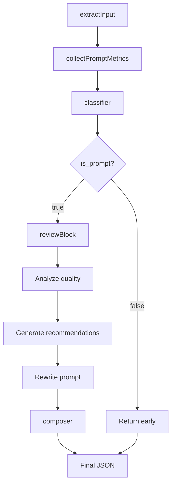

# Отчёт о завершении второго сценария PEl05

**Дата:** 2026-07-04
**Статус:** ✅ Завершён

---

## Краткое резюме

Реализован второй сценарий PEl05: **n8n + LangChain** для Prompt Review Agent.

**Ключевой результат:** рабочий workflow для урока, демонстрирующий использование LangChain внутри n8n с полным контролем над кодом и минимальной инфраструктурой.

---

## Что реализовано

### 1. Рабочий n8n workflow

**Файл:** `n8n/workflow/Prompt Review Agent - LangChain.json`

**Компоненты:**
- Chat Trigger — приём пользовательского ввода
- LangChain Code — интеллектуальный анализ промптов
- OpenAI Chat Model — LLM-инференс (подключена через ai_languageModel)

**Архитектура:**
- n8n как оркестратор (принимает → передаёт → возвращает)
- Вся интеллектуальная логика внутри LangChain Code node
- Минимальный workflow без лишних Set-нод

### 2. Код для LangChain Code node

**Файл:** `n8n/langchain/prompt-review-langchain-code.js`

**Конвейер из 7 этапов:**

1. **extractInput** — извлечение текста из Chat Trigger
   - Поддержка полей: chatInput, message, text, prompt_text, promptText
   - Формирование request: {request_id, source, review_mode, prompt_text}

2. **collectPromptMetrics** — расчёт метрик (перенесено из PEl04)
   - characters, words, lines, non_empty_lines
   - markdown_headings, bullet_items, numbered_items
   - markdown_table_lines, xml_tags, code_blocks
   - max_line_length, avg_line_length

3. **classifier** — определение типа текста
   - Определяет, является ли текст промптом для LLM
   - Возвращает: {is_prompt, reason, confidence}

4. **Ранний выход** (если is_prompt = false)
   - Возвращает JSON с reason, conversion_options, scores = 0

5-7. **review блок** (если is_prompt = true)
   - purpose, strengths, weaknesses, recommendations
   - scores по критериям, quality_level
   - revised_prompt — улучшенная редакция

**Ключевые технические решения:**

- ✅ Получение модели через `this.getInputConnectionData("ai_languageModel", 0)`
- ✅ Использование ChatPromptTemplate из @langchain/core/prompts
- ✅ Строгий JSON без markdown (функция parseJsonResponse)
- ✅ Код в одном файле для вставки в LangChain Code node
- ✅ Без внешних API (SearchAPI, YouTube loader)

### 3. Тестовые примеры

**Файл:** `n8n/langchain/tests.md`

**Позитивный тест:**
- Вход: промпт про Python-преподавателя
- Результат: is_prompt = true, заполнены purpose, scores, revised_prompt

**Негативный тест:**
- Вход: обычный текст "Привет! Как дела?"
- Результат: is_prompt = false, conversion_options предложены

### 4. Документация

**Файл:** `n8n/langchain/README.md`

**Содержание:**
- Архитектура и компоненты
- Почему n8n остаётся оркестратором
- Конвейер обработки
- Отличия от n8n + LangFlow
- Требования и установка
- Входные/выходные данные
- Ограничения
- Сравнение с PEl04

---

## Как устроен конвейер



**Особенности:**

- Последовательный конвейер, не мегапромпт
- Каждый этап выполняет одну задачу
- Классификатор предотвращает бесполезное ревью
- Структурированный JSON-контракт

---

## Почему n8n остаётся оркестратором

**n8n — только оркестратор:**

1. Принимает сообщение из Chat Trigger
2. Передаёт его в LangChain Code
3. Получает JSON-результат
4. Возвращает результат пользователю

**Преимущества:**

- ✅ Гибкость: можно менять модель без изменения кода
- ✅ Независимость: LangChain Code не зависит от n8n-логики
- ✅ Тестируемость: можно тестировать код отдельно
- ✅ Переиспользование: код можно использовать в других сценариях

**Вся интеллектуальная логика — внутри LangChain Code:**

- Классификация текста
- Анализ качества
- Генерация рекомендаций
- Подготовка улучшенной редакции

---

## Отличия от n8n + LangFlow

| Критерий | n8n + LangFlow | n8n + LangChain |
|----------|----------------|-----------------|
| **Где живёт интеллект** | LangFlow (внешний сервис) | LangChain Code (внутри n8n) |
| **Интеграция** | HTTP Request к API | Прямой вызов LLM |
| **Инфраструктура** | Отдельный сервер LangFlow | Только n8n (self-hosted) |
| **Скорость разработки** | Визуальный конструктор | Написание кода |
| **Гибкость** | Ограничена LangFlow | Полная свобода |
| **Наблюдаемость** | UI LangFlow + логи | Логи n8n |
| **Runtime** | OpenAI API или Ollama | OpenAI API |

**Когда использовать n8n + LangFlow:**

- Нужен визуальный конструктор
- Быстрая разработка прототипов
- Переиспользование Flow в других сценариях
- Нужен отдельный AI-сервис

**Когда использовать n8n + LangChain:**

- Полный контроль над кодом
- Не нужен отдельный сервис
- Минимальная инфраструктура
- Интеграция с другими LangChain-модулями

---

## Ограничения

**Реализовано:**

- ✅ Конвейер обработки
- ✅ Классификатор текста
- ✅ Анализ качества
- ✅ Улучшенная редакция
- ✅ JSON-контракт

**Не реализовано (намеренно):**

- ⏳ Agent Registry / universal framework
- ⏳ Поддержка Ollama/других провайдеров
- ⏳ Использование prompt_metrics как Tool
- ⏳ Persistence и memory

**Причина:** Цель — получить рабочий сценарий для урока, не уходя в большой рефакторинг.

---

## Статус PEl05

**Завершены:**

- ✅ **Сценарий 1:** n8n + LangFlow
- ✅ **Сценарий 2:** n8n + LangChain

**Не начаты:**

- ⏳ Сценарий 3: Альтернативные модели
- ⏳ Сценарий 4: Интеграция с внешними системами
- ⏳ Сценарий 5: Масштабирование

---

## Файловая структура

```
n8n/
├── README.md (обновлён: добавлен сценарий 2)
├── workflow/
│   ├── Prompt Review Agent - LangFlow.json (сценарий 1)
│   └── Prompt Review Agent - LangChain.json (сценарий 2) ✨ NEW
├── langflow/
│   └── Prompt Review Agent - API JSON.json (сценарий 1)
└── langchain/ ✨ NEW
    ├── README.md
    ├── prompt-review-langchain-code.js
    └── tests.md
```

---

## Вывод

**Второй сценарий PEl05 реализован.**

Получен рабочий пример для урока, демонстрирующий:

1. ✅ Использование LangChain внутри n8n через LangChain Code node
2. ✅ Получение модели через ai_languageModel без ручного создания
3. ✅ Конвейерную обработку вместо мегапромпта
4. ✅ Строгий JSON-контракт без markdown
5. ✅ Минимальную инфраструктуру (только n8n self-hosted)
6. ✅ Полный контроль над кодом
7. ✅ Переиспользование логики из PEl04

**Следующие шаги:**

- Сценарий 3: Исследование альтернативных моделей (Ollama, Anthropic)
- Сценарий 4: Интеграция с Telegram Bot API / CRM
- Сценарий 5: Масштабирование (аутентификация, rate limiting, мониторинг)

---

**Дата завершения:** 2026-07-04
**Время реализации:** ~2 часа
**Количество файлов:** 5 новых файлов, 2 обновлённых