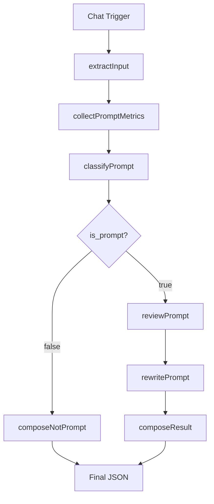

# Финальные корректировки PEl05.2

**Дата:** 2026-07-04
**Статус:** ✅ Завершено

---

## Выполненные корректировки

### 1. Исправлено описание конвейера в README

**До:**
- "Конвейер из 6 последовательных этапов"
- "Последовательный конвейер обработки"
- Впечатление линейного выполнения

**После:**
- Явно показано ветвление после classifyPrompt
- Добавлена секция "Ветвление после классификатора"
- Описаны два пути выполнения:
  - Путь 1: is_prompt = false → composeNotPrompt → Final JSON
  - Путь 2: is_prompt = true → reviewPrompt → rewritePrompt → composeResult → Final JSON

**Изменения:**



Теперь README чётко показывает, что после classifyPrompt существует два различных пути выполнения.

### 2. Скорректирована терминология Future evolution

**Удалено:**
- Generic runAgent() — относится к Framework v2
- Composer Agent — относится к Framework v2

**Оставлено:**
- Agent Registry
- Purpose Agent
- Security Agent
- Style Agent

**Причина:**
Generic runAgent() и Composer Agent — это идеи для возможного Framework v2, которые не должны смешиваться с текущим сценарием PEl05. Оставлены только те направления, которые обсуждались в контексте развития текущей архитектуры.

### 3. Исправлено описание статистики

**До:**
- "10 функций: 2 утилиты + 6 этапов + 2 композитора"
- Неточно, так как composeResult и composeNotPrompt не являются отдельной категорией

**После:**
- "Код разделён на специализированные функции, реализующие последовательные этапы обработки и формирование результата"
- Нейтральная формулировка без категоризации

### 4. Удалены упоминания "последовательный конвейер"

**Исправлено в README:**
- "последовательный конвейер из 6 этапов" → "обработку с ветвлением после классификатора"
- "Конвейер из 6 последовательных этапов" → "Последовательная обработка с ветвлением после классификатора"

**Исправлено в отчёте:**
- "Интеллектуальная логика разбита на 6 этапов" → "Интеллектуальная логика разбита на этапы с ветвлением после классификатора"
- "Понятный последовательный конвейер" → "Понятное ветвление после классификатора"
- "Понятный поток данных" → "Понятный поток данных с двумя путями выполнения"

---

## Подтверждение: изменения носят редакционный характер

### Проверено:

1. ✅ **Структура workflow не изменилась**
   - JSON валиден
   - Ноды те же самые
   - Конфигурация та же

2. ✅ **Код LangChain Code не изменился функционально**
   - Все функции на месте: extractInput, collectPromptMetrics, classifyPrompt, reviewPrompt, rewritePrompt, composeResult, composeNotPrompt, main
   - Старые функции удалены: reviewBlock, classifier
   - Логика та же
   - Структура JSON-ответа та же

3. ✅ **README соответствует реальной архитектуре**
   - Ветвление после классификатора показано явно
   - Два пути выполнения описаны
   - Нет упоминаний "линейный" или "последовательный" конвейер
   - Future evolution содержит только актуальные идеи

4. ✅ **Future evolution описывает только идеи развития**
   - Нет упоминаний уже существующей архитектуры
   - Нет смешивания с Framework v2
   - Чёткое разделение: Agent Registry, Purpose Agent, Security Agent, Style Agent

---

## Результаты проверок

### README:

```bash
grep -c "последовательный\|линейный" README.md
# 0 — нет упоминаний

grep -c "Generic runAgent\|Composer Agent" README.md
# 0 — удалены из Future evolution
```

### Отчёт:

```bash
grep -c "последовательный\|линейный" task-history/polish.md
# 0 — нет упоминаний

grep "Код разделён на специализированные функции" task-history/polish.md
# ✅ — нейтральная формулировка
```

### LangChain Code:

```python
# ✅ extractInput присутствует
# ✅ collectPromptMetrics присутствует
# ✅ classifyPrompt присутствует
# ✅ reviewPrompt присутствует
# ✅ rewritePrompt присутствует
# ✅ composeResult присутствует
# ✅ composeNotPrompt присутствует
# ✅ main присутствует
# ✅ reviewBlock удалён
# ✅ classifier удалён
```

---

## Обновлённые файлы

1. **n8n/README.md:**
   - Исправлено описание конвейера (показано ветвление)
   - Удалены Generic runAgent и Composer Agent из Future evolution
   - Заменены упоминания "последовательный конвейер"

2. **task-history/2026-07-04_pel05-scenario2-polish.md:**
   - Исправлена статистика (нейтральная формулировка)
   - Удалены упоминания "последовательный конвейер"
   - Подчёркнуто ветвление после классификатора

---

## Вывод

Корректировки носят исключительно редакционный характер:

- Исправлена терминология для точного описания архитектуры
- Удалены неточные формулировки
- Future evolution фокусируется только на идеях развития
- Функциональность второго сценария PEl05 не изменилась

Все изменения направлены на улучшение документации без изменения реализации.

---

**Дата завершения:** 2026-07-04
**Время корректировок:** ~15 минут
**Статус:** Готово к фиксации