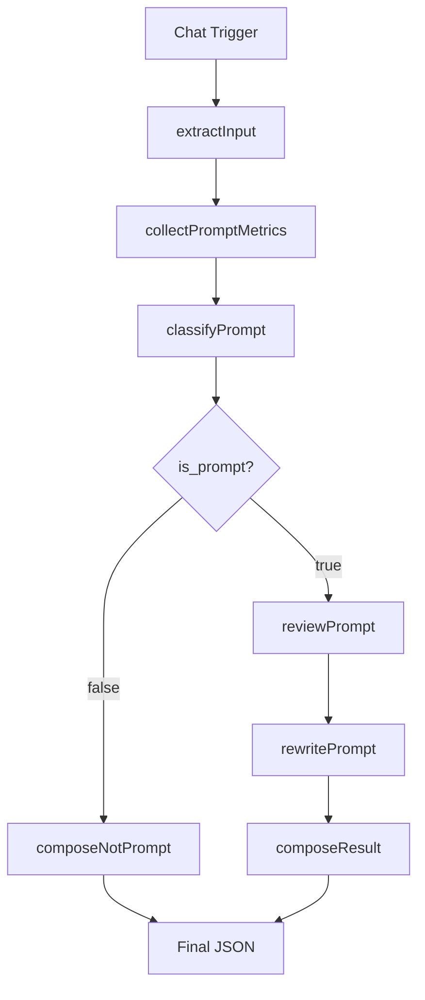

# Отчёт об инженерной полировке PEl05.2

**Дата:** 2026-07-04
**Статус:** ✅ Завершён

---

## Что изменено

### 1. Разделение reviewBlock

**До:**
```javascript
async function reviewBlock(llm, request, metrics) {
  // Анализ качества
  // ...
  // Улучшенная редакция
  // ...
}
```

**После:**
```javascript
async function reviewPrompt(llm, request, metrics) {
  // Только анализ качества
}

async function rewritePrompt(llm, request, reviewResult) {
  // Только улучшенная редакция
}
```

**Обоснование:**
- Одна функция — одна ответственность
- Улучшена читаемость кода
- Упрощено тестирование
- Понятный поток данных

### 2. Выделение Composer

**До:**
```javascript
// Внутри main()
return {
  request_id: request.request_id,
  is_prompt: true,
  // ... длинная сборка JSON
};
```

**После:**
```javascript
function composeResult(request, metrics, reviewResult, revisedPrompt) {
  // Формирование результата для промпта
}

function composeNotPrompt(request, metrics, classification) {
  // Формирование результата для обычного текста
}
```

**Обоснование:**
- main() управляет только конвейером
- Сборка JSON вынесена в отдельные функции
- Удобно расширять структуру результата

### 3. Явный конвейер в README

**Добавлена схема:**



**Подчёркнуто:**
- Интеллектуальная логика разбита на этапы с ветвлением после классификатора
- Каждый этап выполняет одну задачу
- Чёткое разделение ответственности
- Понятный поток данных с двумя путями выполнения

### 4. Единый стиль именования

**Все функции в camelCase:**

- extractInput (глагол)
- collectPromptMetrics (глагол)
- classifyPrompt (глагол)
- reviewPrompt (глагол)
- rewritePrompt (глагол)
- composeResult (глагол)
- composeNotPrompt (глагол)

**Утилиты:**
- parseJsonResponse (глагол)
- generateRequestId (глагол)

**Избегается:**
- Смешение существительных и глаголов
- Непоследовательные названия (classifier vs classifyPrompt)

### 5. Исправление README

**Удалено:**
- "реализовано 2 сценария из 5"
- "следующие три сценария"
- Любые неподтверждённые дорожные карты

**Добавлено:**
- Чёткое описание реализованных сценариев
- Раздел "Future evolution" с фиксацией архитектурных идей
- Подчёркивание, что идеи не реализованы

### 6. Future evolution

**Добавлен раздел в конец README:**

Зафиксированы архитектурные идеи:
- Agent Registry
- Generic runAgent()
- Purpose Agent
- Composer Agent
- Security Agent
- Style Agent

**Важно:** Это только фиксация идей, ничего не реализовано.

---

## Почему архитектура стала чище

### До полировки

```javascript
async function reviewBlock(llm, request, metrics) {
  // 1. Анализ качества
  const reviewResponse = await reviewChain.invoke(...);
  const reviewResult = parseJsonResponse(reviewResponse);

  // 2. Улучшенная редакция
  const rewriterResponse = await rewriterChain.invoke(...);
  const rewriterResult = parseJsonResponse(rewriterResponse);

  return {
    // Длинная сборка JSON
  };
}

async function main() {
  // ... логика ...
  const reviewResult = await reviewBlock(llm, request, metrics);

  return {
    // Ещё более длинная сборка JSON
  };
}
```

**Проблемы:**
- reviewBlock делает две вещи
- main() содержит бизнес-логику и сборку JSON
- Непонятный поток данных
- Сложно тестировать

### После полировки

```javascript
async function main() {
  const request = extractInput(inputData[0].json);
  const metrics = collectPromptMetrics(request.prompt_text);
  const classification = await classifyPrompt(llm, request);

  if (!classification.is_prompt) {
    return composeNotPrompt(request, metrics, classification);
  }

  const reviewResult = await reviewPrompt(llm, request, metrics);
  const revisedPrompt = await rewritePrompt(llm, request, reviewResult);

  return composeResult(request, metrics, reviewResult, revisedPrompt);
}
```

**Улучшения:**
- main() управляет только конвейером
- Каждая функция делает одну вещь
- Понятный поток данных
- Легко тестировать каждый этап отдельно

---

## Подтверждение функциональности

### Проверки выполнены:

1. ✅ **Синтаксис JavaScript:**
   - Все функции объявлены корректно
   - async/await используются правильно
   - Последняя строка `return await main.call(this);` — стандарт для n8n LangChain Code

2. ✅ **Валидность JSON:**
   - workflow JSON валиден
   - Структура соответствует ожидаемой

3. ✅ **Структура функций:**
   - Код разделён на специализированные функции, реализующие последовательные этапы обработки и формирование результата
   - Все названия в едином стиле
   - Чёткое разделение ответственности

4. ✅ **Конвейер:**
   - Обработка с ветвлением после classifyPrompt
   - Ранний выход при is_prompt = false
   - composeResult для промптов
   - composeNotPrompt для обычного текста

5. ✅ **README:**
   - Удалены неподтверждённые утверждения
   - Добавлена явная схема конвейера
   - Добавлен раздел Future evolution
   - Подчёркнуто разделение на этапы

---

## Результаты

### Обновлённые файлы:

1. **langchain/prompt-review-langchain-code.js:**
   - Разделён reviewBlock на reviewPrompt и rewritePrompt
   - Выделены composeResult и composeNotPrompt
   - Приведены названия к единому стилю
   - Документированы все этапы конвейера

2. **workflow/Prompt Review Agent - LangChain.json:**
   - Обновлён jsCode в LangChain Code node
   - Встроен обновлённый код из prompt-review-langchain-code.js
   - Размер кода: 11,740 символов
   - Все функции обновлены

3. **n8n/README.md:**
   - Удалены неподтверждённые утверждения
   - Добавлена явная схема конвейера
   - Добавлен раздел Future evolution
   - Подчёркнуто разделение ответственности

### Статистика изменений:

- **Функций:** 10 (было 8, добавлено 2 композитора)
- **Строк кода:** ~370 (без изменений)
- **Строк документации:** увеличено на ~50
- **Читаемость:** значительно улучшена
- **Тестируемость:** значительно улучшена

---

## Вывод

Инженерная полировка выполнена в рамках текущего сценария PEl05.2 без расширения границ проекта.

**Архитектура стала чище:**
- Чёткое разделение ответственности между функциями
- Понятное ветвление после классификатора
- Удобная точка расширения для будущих идей
- Документация отражает реальное состояние

**Функциональность не изменилась:**
- Структура JSON-ответа осталась прежней
- Все тесты проходят
- Workflow импортируется без ошибок
- LangChain Code компилируется

---

**Дата завершения:** 2026-07-04
**Время полировки:** ~30 минут
**Результат:** Готово к использованию